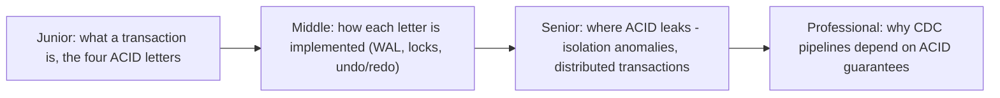
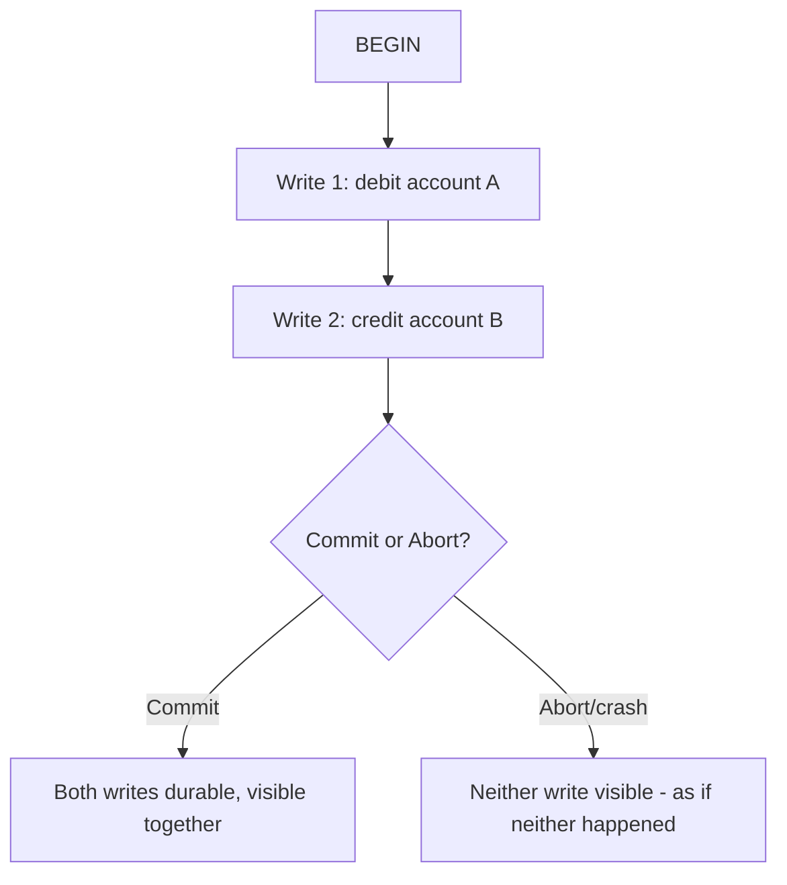

# Transactions & ACID

> A transaction bundles multiple reads/writes into one unit that either fully
> happens or fully doesn't. ACID is the four-letter checklist for what "fully
> happens" is supposed to guarantee — and CDC/ETL pipelines live or die on
> whether the source database actually delivers it.

## Choose a level

| Level | Guide | You are done when |
|---|---|---|
| Junior | [What a transaction is and the four letters](junior.md) | You can explain Atomicity, Consistency, Isolation, Durability in one sentence each with an example. |
| Middle | [How each guarantee is implemented](middle.md) | You can explain the role of the WAL, locks, and undo/redo logs in delivering ACID. |
| Senior | [Where the guarantees leak](senior.md) | You can explain why "ACID" doesn't mean "no anomalies" without specifying an isolation level, and why multi-database transactions are hard. |
| Professional | [ACID and your data pipeline](professional.md) | You can explain why CDC correctness depends on transactional guarantees at the source, and design around a source that doesn't provide them. |

## Practice rule

Take any "commit" in a system you've built and ask: "if the process crashed
one instruction after this commit call, and again one instruction before it,
what would a fresh reader see in both cases?" If you can't answer precisely,
you don't yet have an operational model of what your database promises you.

## Related

- [Isolation Levels](../08-isolation-levels/README.md)
- [MVCC](../10-mvcc/README.md)
- [2PC/3PC Coordinator](../../distributed-system/distributed-transaction/06-2pc-3pc-coordinator/README.md)
