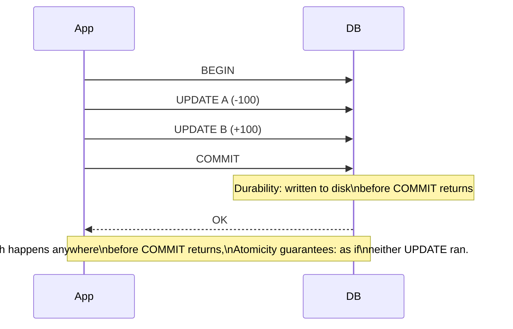

# Transactions & ACID — Junior

<!-- level-focus -->
At junior level, focus on this question:

> What does each letter of ACID actually promise, in terms you could verify?

---

## The classic example: a bank transfer

```sql
BEGIN;
UPDATE accounts SET balance = balance - 100 WHERE id = 'A';
UPDATE accounts SET balance = balance + 100 WHERE id = 'B';
COMMIT;
```

Two writes. If your process crashes between them, does account A lose $100
that never reaches B? A **transaction** groups these two writes so the
database guarantees one of two outcomes: both happen, or neither does.

## The four letters

| Letter | Promise | Bank-transfer example |
|---|---|---|
| **Atomicity** | All writes in the transaction happen, or none do. No partial transaction is ever visible. | If the process crashes after the debit but before the credit, the database rolls the debit back too — A never loses the $100. |
| **Consistency** | The transaction moves the database from one valid state to another, respecting its own declared rules (constraints, foreign keys). | A `CHECK (balance >= 0)` constraint prevents the debit from ever landing if it would make A negative — the transaction aborts instead. |
| **Isolation** | Concurrent transactions don't see each other's half-finished work. | A third transaction reading A and B's balances never sees "A already debited, B not yet credited" — the intermediate state is invisible. |
| **Durability** | Once committed, the write survives a crash — even a power loss the instant after commit. | If the server loses power one millisecond after `COMMIT` returns, the transfer is still there on reboot. |



> 🎓 **Takeaway:** "ACID" isn't marketing — it's four independently checkable
> promises. You can test each one directly: kill the process mid-transaction
> (atomicity), try to violate a constraint (consistency), run two
> transactions concurrently and inspect what each sees (isolation), and pull
> the power cord right after a commit (durability).

## Test yourself

1. Which letter is violated if a crash mid-transaction leaves A debited but B
   not yet credited, and that state is visible after restart?
2. Which letter is violated if a `NOT NULL` constraint silently allows a null
   value through?
3. Why is "isolation" a claim about *concurrent* transactions specifically,
   while the other three letters make sense even with a single transaction
   running alone?

Continue to [`middle.md`](middle.md).
