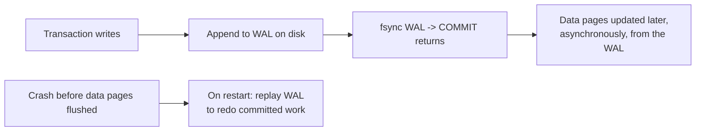

# Transactions & ACID — Middle

<!-- level-focus -->
At middle level, focus on this question:

> What mechanism actually delivers each ACID guarantee under the hood?

Prerequisite: [`junior.md`](junior.md).

---

## Durability + Atomicity: the Write-Ahead Log (WAL)

Before any data page on disk is modified, the database writes a record of the
intended change to an append-only **write-ahead log**, and only then
acknowledges the commit.



This is the mechanism a data engineer meets directly: **Debezium and every
CDC connector read the WAL**, not the data files — because the WAL is the
durable, ordered record of every committed change, which is exactly what a
change-data-capture pipeline needs to stream reliably.

Atomicity uses the same log in reverse: if a transaction aborts (or the
process crashes before commit), the database uses **undo records** (or simply
never replays an uncommitted WAL entry) so none of its partial writes are
ever applied.

## Consistency: constraints checked at commit

Constraints (`CHECK`, `NOT NULL`, `FOREIGN KEY`, `UNIQUE`) are evaluated
before a transaction is allowed to commit. If any constraint fails, the whole
transaction aborts — this is Atomicity and Consistency working together:
"all or nothing" plus "only valid states allowed."

```sql
BEGIN;
UPDATE accounts SET balance = balance - 1000000 WHERE id = 'A';
-- fails: CHECK (balance >= 0) violated
COMMIT; -- never reached; the whole transaction rolls back
```

## Isolation: locks or multi-version snapshots

Two mechanisms achieve isolation, and most production databases use a mix:

- **Locking**: a transaction takes a lock on a row before reading/writing it;
  other transactions wanting the same row wait. Simple to reason about, but
  readers and writers can block each other.
- **MVCC (Multi-Version Concurrency Control)**: each transaction sees a
  consistent **snapshot** of the database as of when it started; writers
  create new row versions instead of overwriting in place, so readers never
  block on writers. Covered in depth in [MVCC](../10-mvcc/README.md).

The exact anomalies you're protected from depend on which **isolation level**
you pick — "Isolation" is a single letter but a whole spectrum, covered in
[Isolation Levels](../08-isolation-levels/README.md).

## Test yourself

1. Why does Debezium read the WAL instead of polling the table with
   `SELECT * WHERE updated_at > last_poll`?
2. If the WAL is written and `fsync`'d before `COMMIT` returns, but the actual
   data page update happens later — what makes this still Atomic and
   Durable, not a contradiction?
3. Give one reason MVCC is generally preferred over pure locking for
   read-heavy analytical workloads running against an OLTP replica.

Continue to [`senior.md`](senior.md).
