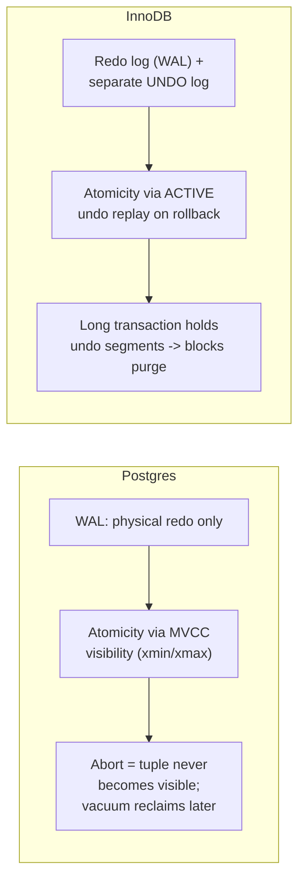
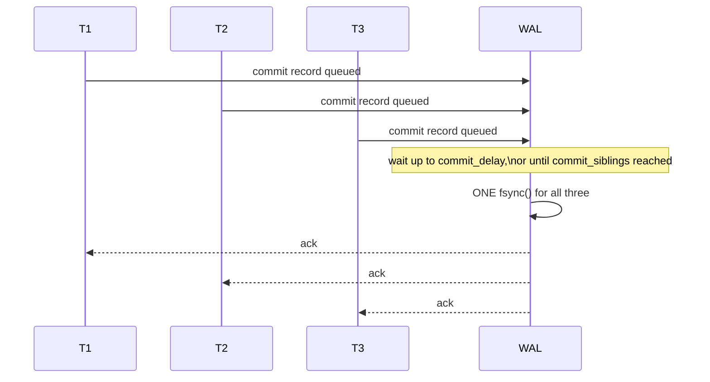

# Transactions & ACID — Professional

<!-- level-focus -->
At professional level, focus on this question:

> What do WAL, undo logs, and group commit actually look like inside a real
> storage engine, and where does each ACID guarantee break down first under
> extreme load?

Prerequisite: [`senior.md`](senior.md).

---

## Two WAL philosophies: physical-redo-only vs. redo+undo

Postgres's WAL is **physical, redo-only**: it records byte-level changes to
pages ("at LSN X, page P bytes [a,b) become [new bytes]"). Rollback doesn't
replay an "undo" log at all — Postgres relies on MVCC (a new tuple version
tagged with an uncommitted `xmin` is simply never visible to anyone, and
vacuum eventually reclaims it). This means **Postgres's atomicity comes
almost for free from MVCC visibility rules**, not from an active undo
mechanism.

InnoDB (MySQL) does the opposite: it maintains a genuine **undo log** in the
system tablespace, storing the *previous* version of each modified row.
Rollback actively replays undo records to reconstruct the pre-transaction
state, and a long-running transaction holding open undo segments prevents
purge — InnoDB's direct analog to Postgres's vacuum-blocked-by-long-transaction
problem, just implemented via undo-segment retention instead of tuple
visibility horizons.



## Durability's real cost center: fsync and group commit

The "D" in ACID is, mechanically, a call to `fsync()` (or `fdatasync`,
`O_DIRECT` writes) forcing the WAL buffer to durable storage before a commit
returns. A naive implementation calls `fsync` once per transaction commit —
on spinning disks this was catastrophic (single-digit thousands of commits/sec
ceiling from rotational latency alone); even on NVMe SSDs, `fsync` latency
(tens to low-hundreds of microseconds) caps naive single-transaction commit
throughput far below what the storage device's raw IOPS would suggest.

**Group commit** is the mitigation nearly every serious engine implements:
multiple concurrent transactions' commit records are batched into a single
`fsync` call, amortizing the durability cost across N transactions.
Postgres's `commit_delay`/`commit_siblings` and MySQL's binary-log group
commit both exist specifically to widen this batching window under load —
tuning them is a direct trade of **commit latency for commit throughput**,
and getting it wrong either leaves throughput on the table (window too
narrow) or adds unacceptable p99 commit latency (window too wide).



## Where each ACID letter actually breaks first at scale

| Letter | First failure mode at scale | Real signal |
|---|---|---|
| Atomicity | Not usually the bottleneck — implemented via MVCC/undo, cost is amortized into normal write path | N/A directly; manifests as isolation/durability symptoms instead |
| Consistency | Constraint checks (especially `FOREIGN KEY` and deferred `UNIQUE` constraint validation) become a serialization point under high concurrent write volume on the same referenced table | Lock waits on the referenced table's index during high-concurrency inserts into a child table |
| Isolation | Predicate/gap locks (needed for phantom prevention under `REPEATABLE READ`/`SERIALIZABLE`) escalate lock footprint and contention under high insert concurrency into the same key range | `SHOW ENGINE INNODB STATUS` lock waits on gap/next-key locks; Postgres `pg_locks` growth on `SIReadLock` |
| Durability | `fsync` latency becomes the transaction throughput ceiling once group-commit batching is saturated; WAL disk I/O becomes the bottleneck resource, not CPU | WAL write latency and `fsync` call count relative to commit rate; storage device IOPS/latency exhaustion, not CPU/memory pressure |

## Production checklist (staff-level)

1. **Know whether your engine's atomicity is MVCC-visibility-based (Postgres)
   or active-undo-based (InnoDB) before diagnosing a long-transaction
   incident** — the operational fix differs: vacuum tuning vs. undo tablespace
   sizing and purge lag monitoring.
2. **Tune group-commit parameters against measured commit latency
   percentiles, not just throughput** — a wider batching window trades
   median throughput gains for tail latency; validate against your actual
   SLA, not a synthetic benchmark.
3. **Separate WAL/redo-log storage onto dedicated, low-latency devices**
   under sustained high-commit-rate workloads — WAL is the durability
   critical path and contends with data-file I/O if colocated.
4. **Alert on undo tablespace/segment growth (InnoDB) or transaction ID
   age / dead-tuple growth (Postgres) as a unified "long transaction risk"
   signal**, even though the underlying mechanisms differ.
5. **In a postmortem for a durability-related data loss incident**, always
   check `fsync` configuration first (`synchronous_commit = off`, storage
   write-cache settings ignoring flush commands) — most "durability wasn't
   real" incidents trace back to a durability-affecting setting turned off
   for performance and never revisited.

## Cheat Sheet

```text
+------------------------------------------------------------------+
|              TRANSACTIONS & ACID — INTERNALS & SCALE                |
+------------------------------------------------------------------+
| Postgres: physical redo-only WAL, atomicity via MVCC visibility       |
| InnoDB: redo log + ACTIVE undo log, atomicity via undo replay          |
|   -> different long-transaction failure modes (vacuum vs. purge lag)  |
+------------------------------------------------------------------+
| Durability = fsync() on the critical path. Naive: 1 fsync/commit,     |
| throughput-limited by storage flush latency regardless of raw IOPS.   |
| Group commit: batch many commits into ONE fsync -                     |
|   trades commit latency for throughput; tune against real SLA        |
+------------------------------------------------------------------+
| First bottleneck by letter, at scale:                                  |
|   Consistency -> FK/unique constraint checks serialize on hot tables   |
|   Isolation    -> gap/predicate lock footprint under insert concurrency|
|   Durability    -> fsync/WAL I/O becomes the real throughput ceiling   |
+------------------------------------------------------------------+
```

## Test yourself

1. Why does a long-running transaction threaten Postgres via vacuum/XID
   wraparound risk, but threaten InnoDB via a different mechanism (undo
   segment/purge lag)? What operational metric would you check for each?
2. A team widens `commit_delay` to improve throughput and later gets paged
   for p99 commit latency SLA violations. Explain the trade-off they made
   and how you'd re-tune it.
3. In a postmortem, you discover `synchronous_commit = off` was set during a
   performance incident 6 months ago and never reverted, and a crash just
   lost committed-looking transactions. Walk through why this happened.

## Further Reading

- PostgreSQL source/documentation — "Write-Ahead Logging (WAL)" and
  "Reliability and the Write-Ahead Log."
- MySQL/InnoDB documentation — "InnoDB Undo Logs" and "Group Commit for
  Redo Log Flushing."
- Jim Gray & Andreas Reuter — *Transaction Processing: Concepts and
  Techniques* (group commit's original formalization).
- See also: [MVCC — professional](../10-mvcc/professional.md),
  [Isolation Levels — professional](../08-isolation-levels/professional.md).
