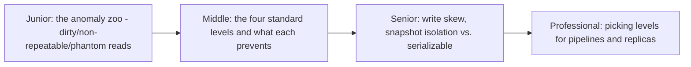
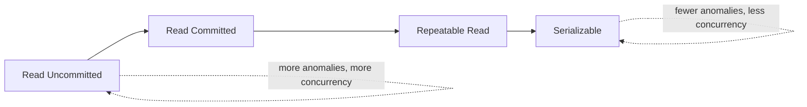

# Isolation Levels

> "Isolation" in ACID is a dial, not a switch. Each level trades correctness
> against concurrency by permitting a different set of anomalies — and the
> default your database ships with is usually weaker than you assume.

## Choose a level

| Level | Guide | You are done when |
|---|---|---|
| Junior | [The anomaly zoo](junior.md) | You can define dirty read, non-repeatable read, and phantom read with a two-transaction example each. |
| Middle | [The four standard isolation levels](middle.md) | You can say which anomalies each of the four standard levels prevents and allows. |
| Senior | [Write skew and snapshot isolation](senior.md) | You can construct a write-skew example that snapshot isolation fails to prevent. |
| Professional | [Choosing levels for pipelines and replicas](professional.md) | You can justify an isolation-level choice for a specific extraction or replica-read workload. |

## Practice rule

For any query you write against a shared database, ask: "what isolation level
is this connection running at, and which anomaly from the table in `junior.md`
could this specific query be exposed to?" If you don't know the connection's
isolation level, you don't know what your query is actually protected from.

## Related

- [Transactions & ACID](../07-transactions-and-acid/README.md)
- [MVCC](../10-mvcc/README.md)
- [Locking & Concurrency Control](../09-locking-and-concurrency-control/README.md)
