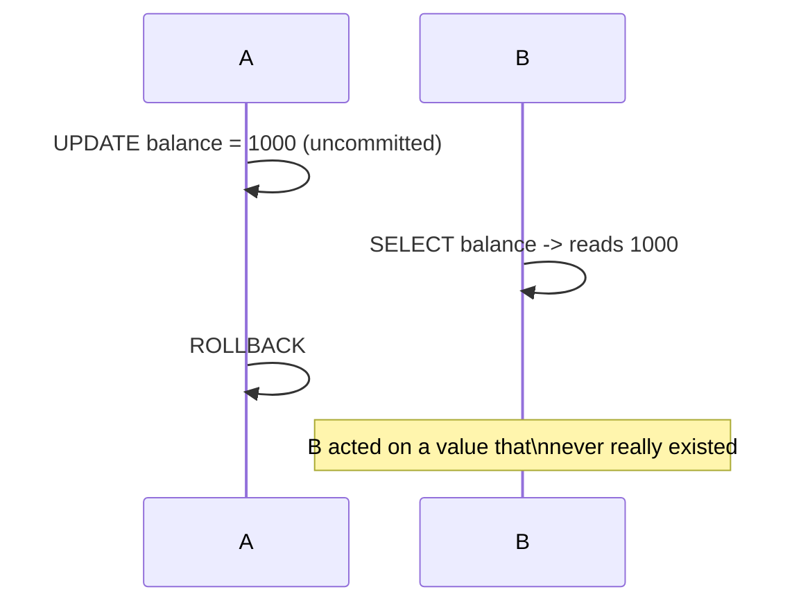

# Isolation Levels — Junior

<!-- level-focus -->
At junior level, focus on this question:

> What are the three classic anomalies that isolation levels are named after,
> and what does each one look like with two concurrent transactions?

---

## Dirty read

Transaction B reads a value that transaction A wrote but hasn't committed
yet — and A then rolls back.



## Non-repeatable read

Transaction B reads the same row twice within one transaction, and gets a
different value the second time because A committed a change in between.

```mermaid
sequenceDiagram
    participant A
    participant B
    B->>B: SELECT balance -> 500
    A->>A: UPDATE balance = 800; COMMIT
    B->>B: SELECT balance (again, same txn) -> 800
    Note over B: Same query, same transaction,\ndifferent answer
```

## Phantom read

Transaction B runs the same *range* query twice within one transaction, and a
new row appears the second time because A inserted a matching row and
committed in between.

```mermaid
sequenceDiagram
    participant A
    participant B
    B->>B: SELECT * FROM orders WHERE amount > 100 -> 3 rows
    A->>A: INSERT INTO orders (amount=150); COMMIT
    B->>B: SELECT * FROM orders WHERE amount > 100 (again) -> 4 rows
    Note over B: New row appeared out of nowhere\nwithin the same transaction
```

## The anomaly table

| Anomaly | What changes between two reads | Caused by |
|---|---|---|
| **Dirty read** | Reading uncommitted data that gets rolled back | No isolation from in-progress writes |
| **Non-repeatable read** | Same row, different value on re-read | A committed write landed between your two reads |
| **Phantom read** | Same range query, different row *set* on re-read | A committed insert/delete landed between your two reads |

> 🎓 **Takeaway:** each anomaly is defined by "what can change out from under
> me while my own transaction is still running." Isolation levels are just a
> menu of which of these three you're protected from.

## Test yourself

1. Is a dirty read possible if the writer transaction has already committed?
   Why or why not?
2. Give a real pipeline scenario where a non-repeatable read inside a long
   analytical query would produce a misleading report.
3. Why is a phantom read a distinct problem from a non-repeatable read, even
   though both involve "the same query, different second answer"?

Continue to [`middle.md`](middle.md).
