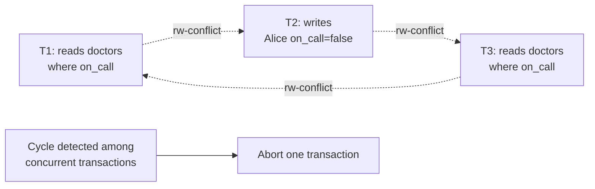
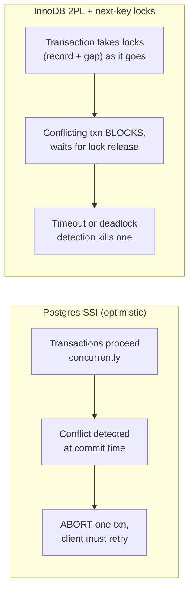

# Isolation Levels — Professional

<!-- level-focus -->
At professional level, focus on this question:

> How does a real database implement Serializable isolation without simply
> locking everything, and what does the internal machinery cost at scale?

Prerequisite: [`senior.md`](senior.md).

---

## Serializable Snapshot Isolation (SSI): Postgres's actual mechanism

Postgres implements `SERIALIZABLE` not via two-phase locking but via
**Serializable Snapshot Isolation (SSI)**, based on Cahill, Röhm & Fekete's
2008 algorithm. Every transaction runs on an MVCC snapshot (like
`REPEATABLE READ`) but the engine additionally tracks **read-write
dependencies** between concurrent transactions using lightweight
**SIREAD locks** (predicate locks that don't block anything by themselves —
they're pure bookkeeping). If the engine detects a specific unsafe pattern —
a **"dangerous structure"**: a cycle of rw-antidependencies among concurrent
transactions (T1 reads what T2 later writes, T2 reads what T3 later writes,
back to T1) — it aborts one transaction with a serialization failure,
`ERROR: could not serialize access due to read/write dependencies`.



The cost model this creates is fundamentally different from locking: SSI
does **not** prevent conflicting transactions from proceeding concurrently —
it lets them run and only pays a cost (an abort + required client retry) when
a genuine dangerous structure is detected. At low contention this is nearly
free; at high contention on the same predicate space, the **abort rate**
itself becomes the throughput-limiting factor, and application code must
implement retry loops or Serializable isolation effectively doesn't work in
practice (a transaction that keeps aborting forever under sustained
contention is a real production failure mode, not a theoretical one).

## Two-phase locking (2PL) and its cost: MySQL/InnoDB's world

InnoDB's `REPEATABLE READ` (its default, and notably **stronger** than the
SQL standard requires — it prevents phantom reads via **next-key locking**,
a combination of a record lock plus a gap lock covering the range before it)
uses genuine locking, not optimistic conflict detection. This means
contention manifests as **lock wait time**, not abort rate — a transaction
simply blocks until the lock is available, or times out
(`innodb_lock_wait_timeout`) and raises a deadlock/timeout error.

**Next-key locking's practical cost**: an `INSERT` into a table with a
non-unique secondary index under `REPEATABLE READ` can take a gap lock
covering a *range* of the index, not just the row being inserted — meaning
two inserts of *different* values into the same gap can deadlock each other,
a notorious and frequently-misdiagnosed InnoDB production issue that has
nothing to do with the actual row values involved.



## Scale failure modes, concretely

| Symptom at high concurrency | Root cause | Diagnostic |
|---|---|---|
| Postgres `SERIALIZABLE` throughput collapses under load that `REPEATABLE READ` handles fine | SSI abort rate rising with contention on overlapping predicates — the "retry storm" failure mode | `pg_stat_database.checksum_failures`-adjacent: watch `40001` serialization_failure error rate in logs, not just latency |
| InnoDB inserts into a hot table intermittently deadlock with no obvious row overlap | Next-key gap locks on a non-unique secondary index conflicting on **range**, not value | `SHOW ENGINE INNODB STATUS` deadlock report — look for gap lock entries, not just record locks |
| A Postgres app's retry logic "works" in staging but causes cascading failure in production under real contention | Naive retry-immediately loops amplify contention right after an abort (the exact set of transactions most likely to conflict again immediately retrying at the same instant) | Correlate `40001` error spikes with retry-triggered secondary spikes; check for exponential backoff in retry logic |

## Production checklist (staff-level)

1. **Never deploy `SERIALIZABLE` without a retry loop with backoff and
   jitter in the client** — SSI's entire design assumes the application
   handles serialization failures as a normal, expected control flow path,
   not an exceptional error.
2. **Load-test Serializable isolation under your actual contention profile
   before committing to it**, not just for correctness — abort rate under
   realistic concurrent write patterns is the real throughput ceiling, and
   it's invisible in a low-concurrency functional test.
3. **For InnoDB, audit non-unique secondary index insert patterns for
   next-key gap lock deadlock risk** — this is a well-known, specific,
   diagnosable failure mode, not a generic "database is slow" symptom.
4. **Choose SSI over 2PL-style Serializable when contention is low/moderate
   and correctness matters** (SSI's optimistic model wins here); choose
   explicit locking (`SELECT ... FOR UPDATE`) over Serializable when
   contention is high and predictable, because a lock wait is often cheaper
   in aggregate than a repeated abort-retry cycle on the same hot rows.
5. **In an incident review for a serialization-failure storm, look for
   retry amplification** as the actual root cause, not the isolation level
   itself — the fix is usually backoff/jitter tuning, not abandoning
   Serializable isolation.

## Cheat Sheet

```text
+------------------------------------------------------------------+
|          ISOLATION LEVELS — INTERNALS & SCALE                       |
+------------------------------------------------------------------+
| Postgres SERIALIZABLE = SSI (Cahill/Rohm/Fekete):                     |
|   optimistic, SIREAD locks are bookkeeping only, transactions run      |
|   concurrently, ABORT on detected dangerous structure (rw-cycle)       |
|   -> cost = abort rate under contention, not blocking                  |
+------------------------------------------------------------------+
| InnoDB REPEATABLE READ = true 2PL + next-key locking                  |
|   (record lock + gap lock) -> prevents phantoms via LOCKING,           |
|   cost = lock wait time / deadlocks, including gap-only conflicts      |
|   between DIFFERENT values inserted into the same index gap            |
+------------------------------------------------------------------+
| SSI needs client retry-with-backoff by design - deploying it           |
| without one is a production incident waiting to happen                |
+------------------------------------------------------------------+
| Diagnose: Postgres -> 40001 serialization_failure rate                |
|          InnoDB    -> SHOW ENGINE INNODB STATUS gap-lock deadlocks    |
+------------------------------------------------------------------+
```

## Test yourself

1. Explain why Postgres's SSI can let two conflicting transactions run fully
   concurrently and only detect the problem at commit time, while InnoDB's
   2PL prevents the conflict from ever proceeding in the first place.
2. Two InnoDB `INSERT` statements with completely different values on a
   non-unique indexed column deadlock each other. What mechanism causes
   this, and how would you fix the schema or query pattern?
3. A Postgres service deploys `SERIALIZABLE` with a naive immediate-retry
   loop and experiences a cascading outage under load. Diagnose the failure
   mode and propose the fix.

## Further Reading

- Cahill, Röhm, Fekete — "Serializable Isolation for Snapshot Databases"
  (VLDB 2008 — the SSI algorithm Postgres implements).
- PostgreSQL documentation — "Serializable Isolation Level" and "Explicit
  Locking" (predicate locking internals).
- MySQL/InnoDB documentation — "InnoDB Locking" (next-key locks, gap locks,
  and the specific deadlock scenarios they cause).
- See also: [Locking & Concurrency Control — professional](../09-locking-and-concurrency-control/professional.md),
  [MVCC — professional](../10-mvcc/professional.md).
