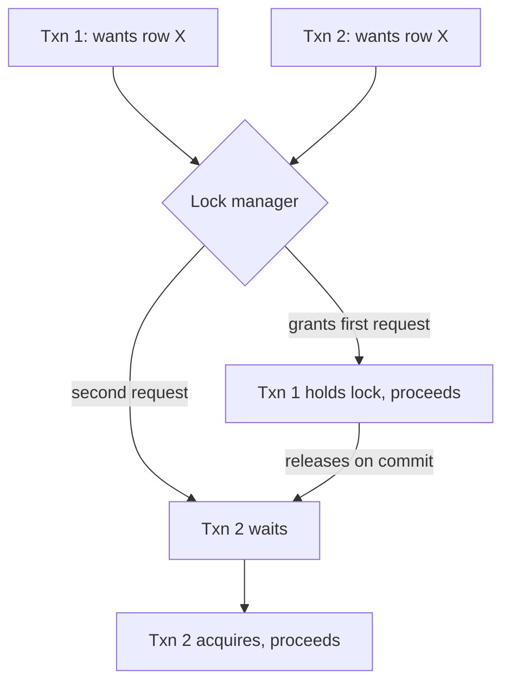

# Locking & Concurrency Control

> When two transactions want the same row at the same time, something has to
> give: one waits, one aborts, or one reads a version that doesn't reflect
> the other's in-progress write. Locking is the mechanism that decides which.

## Choose a level

| Level | Guide | You are done when |
|---|---|---|
| Junior | [Shared vs. exclusive locks](junior.md) | You can explain why two readers can proceed together but a writer must wait for both. |
| Middle | [Granularity and deadlocks](middle.md) | You can explain row vs. table locking trade-offs and construct a two-transaction deadlock. |
| Senior | [Optimistic vs. pessimistic concurrency control](senior.md) | You can decide between `SELECT ... FOR UPDATE` and an optimistic version check for a given contention profile. |
| Professional | [Locking strategy for pipelines](professional.md) | You can design locking for a pipeline writer that must coexist safely with application writers on the same table. |

## Practice rule

Before adding `SELECT ... FOR UPDATE` anywhere, ask: "how many other
transactions typically want this same row at the same time?" If the honest
answer is "almost never," you likely want optimistic concurrency control
instead — locking pessimistically for rare contention wastes throughput on
the common, uncontended case.

## Related

- [Isolation Levels](../08-isolation-levels/README.md)
- [MVCC](../10-mvcc/README.md)
- [Optimistic vs Pessimistic Locking](../../distributed-system/18-concurrency-coordination/04-optimistic-vs-pessimistic-locking/README.md)
