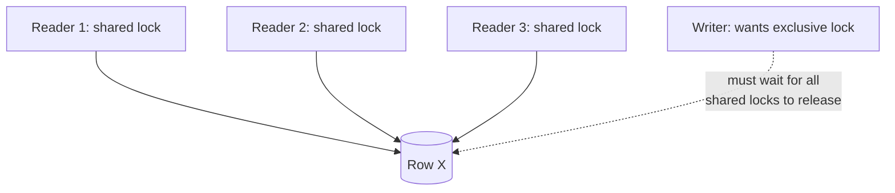

# Locking & Concurrency Control — Junior

<!-- level-focus -->
At junior level, focus on this question:

> Why does a database allow many concurrent readers of the same row but only
> one writer at a time?

---

## Shared and exclusive locks

| Lock type | Who else can hold it at the same time | Used for |
|---|---|---|
| **Shared (S)** | Any number of other shared locks | Reading a row |
| **Exclusive (X)** | Nobody — not shared, not exclusive | Writing a row |



Multiple readers holding shared locks don't conflict with each other — they
just want to look, not change anything. A writer wanting an exclusive lock
must wait until **every** shared lock (and any other exclusive lock) on that
row is released, because letting a write proceed while a reader is mid-read
could hand that reader a torn or inconsistent value.

## A concrete two-transaction example

```sql
-- Transaction 1
BEGIN;
SELECT * FROM accounts WHERE id = 'A' FOR UPDATE;  -- exclusive lock on row A
-- ... does some work ...
COMMIT;  -- lock released here

-- Transaction 2 (running concurrently)
BEGIN;
SELECT * FROM accounts WHERE id = 'A' FOR UPDATE;  -- BLOCKS until Txn 1 commits
```

`FOR UPDATE` explicitly requests an exclusive lock on the rows a `SELECT`
returns, so a second transaction wanting to update the same row is forced to
wait — this is how you manually prevent two transactions from racing to read
then write the same row (the lost-update problem).

> 🎓 **Takeaway:** locks are how a database turns "many transactions running
> concurrently" into "each transaction behaves, for the rows it locks, as if
> it had exclusive access." The cost is that a slow writer makes every other
> transaction wanting the same row wait.

## Test yourself

1. Can two transactions both hold a shared lock on the same row at the same
   time? Can two hold an exclusive lock?
2. Why does `SELECT` (without `FOR UPDATE`) typically not block a concurrent
   writer under Read Committed, while `SELECT ... FOR UPDATE` does?
3. What happens to Transaction 2 above if Transaction 1 never commits or
   rolls back (e.g. its application process hangs)?

Continue to [`middle.md`](middle.md).
