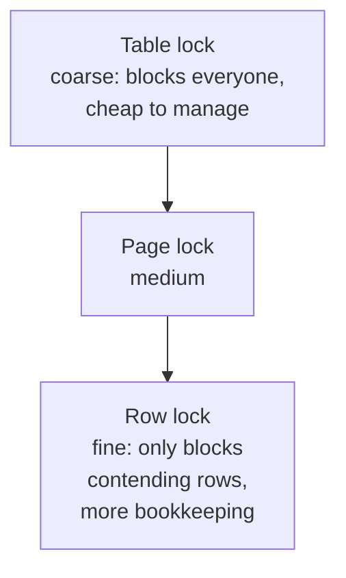
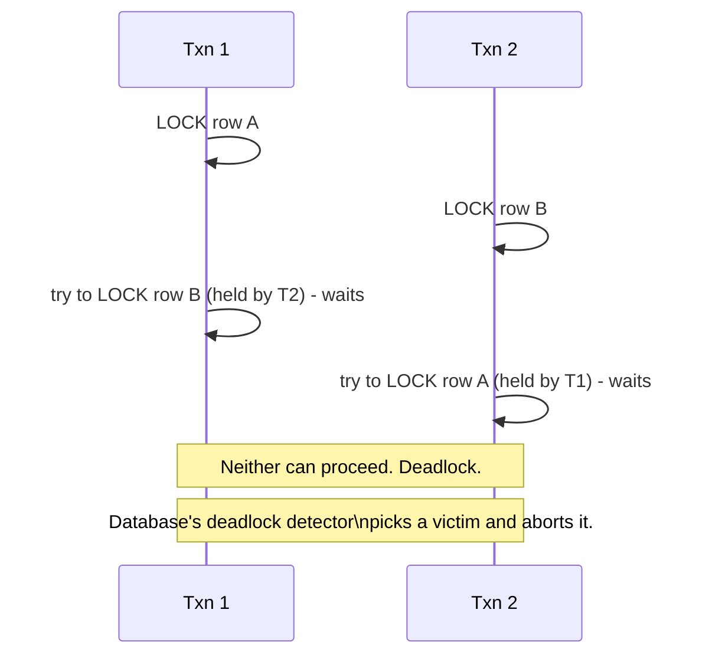

# Locking & Concurrency Control — Middle

<!-- level-focus -->
At middle level, focus on this question:

> What's the trade-off between locking a row, a page, or a table — and how
> does a deadlock actually happen?

Prerequisite: [`junior.md`](junior.md).

---

## Lock granularity



| Granularity | Concurrency | Overhead |
|---|---|---|
| Table-level | Lowest — one writer anywhere blocks everyone | Lowest — one lock to track |
| Page-level | Medium | Medium |
| Row-level | Highest — only transactions touching the *same* row conflict | Highest — potentially millions of locks tracked |

Most production databases default to **row-level locking** for regular DML,
escalating to broader locks only for schema changes (`ALTER TABLE`) or
explicit full-table operations — because row-level locking maximizes
concurrency for the common OLTP case of many transactions touching different
rows simultaneously.

## Deadlocks

A deadlock happens when two transactions each hold a lock the other needs.



```sql
-- Transaction 1                    -- Transaction 2
BEGIN;                              BEGIN;
UPDATE accounts SET ... WHERE id='A';  UPDATE accounts SET ... WHERE id='B';
UPDATE accounts SET ... WHERE id='B';  UPDATE accounts SET ... WHERE id='A';
-- blocks waiting for T2's lock on B    -- blocks waiting for T1's lock on A
```

Databases run a **deadlock detector** (a cycle-detection algorithm over the
wait-for graph) and resolve it by aborting one transaction (the "victim,"
usually the one that's done the least work or is configured as lower
priority), letting the other proceed. The aborted transaction's application
code must be ready to **retry**.

## Preventing deadlocks, not just detecting them

The most reliable fix: **always acquire locks in the same order** across
every code path that touches the same set of rows/tables. If every
transaction that touches accounts A and B always locks the lower ID first,
the specific interleaving above (T1 locks A then wants B; T2 locks B then
wants A) can't occur.

```sql
-- Always lock in a fixed order (e.g. by primary key ascending)
BEGIN;
SELECT * FROM accounts WHERE id IN ('A', 'B') ORDER BY id FOR UPDATE;
-- both A and B locked in the same order, every time, by every transaction
```

## Test yourself

1. Why does row-level locking cost more in bookkeeping than table-level
   locking, and why is that cost usually worth paying?
2. In the deadlock example, if both transactions always locked rows in
   alphabetical order (A before B), would the deadlock still occur? Trace it.
3. What must application code do differently when it knows a transaction can
   be aborted as a deadlock victim, versus assuming a transaction only fails
   due to a constraint violation?

Continue to [`senior.md`](senior.md).
