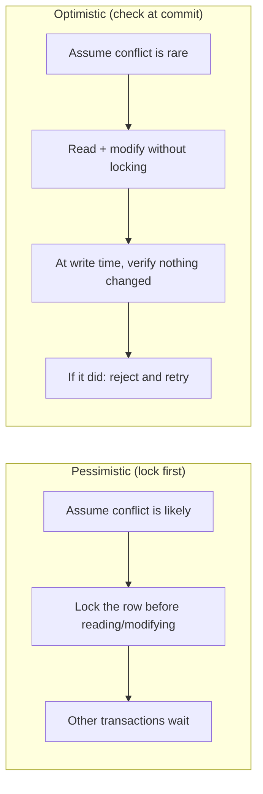

# Locking & Concurrency Control — Senior

<!-- level-focus -->
At senior level, focus on this question:

> When should you use pessimistic locking (`FOR UPDATE`), and when is
> optimistic concurrency control the better tool?

Prerequisite: [`middle.md`](middle.md).

---

## Two philosophies



**Pessimistic (locking)**: acquire the lock before doing any work, so no
other transaction can interfere. Correct by construction, but every
contending transaction pays a wait, even when conflicts turn out to be rare.

**Optimistic (version check)**: read data without locking, do your
computation, and at write time verify the data hasn't changed since you read
it — typically via a `version` column or `updated_at` timestamp. If it
changed, reject the write and let the caller retry. Zero waiting cost when
conflicts are rare; wasted work (a rejected write, requiring a retry) when
they're not.

## Optimistic concurrency control in practice

```sql
-- Read
SELECT id, quantity, version FROM inventory WHERE sku = 'WIDGET-1';
-- app got: quantity=10, version=5

-- Write, guarded by the version read earlier
UPDATE inventory
SET quantity = quantity - 1, version = version + 1
WHERE sku = 'WIDGET-1' AND version = 5;
-- if another transaction updated this row first, version is no longer 5,
-- 0 rows are affected, and the application must re-read and retry
```

The `WHERE version = 5` clause is the entire mechanism: the database's normal
row-locking during the `UPDATE` statement itself still applies (no two
`UPDATE`s can race on the exact same row simultaneously), but no lock is held
**between** the read and the write — the classic long-held-lock cost of
pessimistic locking disappears.

## Choosing between them

| Signal | Favor |
|---|---|
| High contention on the same rows (many transactions racing for the same hot row) | Pessimistic — optimistic would mean most attempts fail and retry, wasting work |
| Low contention, most transactions touch different rows | Optimistic — avoids paying lock overhead for conflicts that rarely happen |
| Long-running transaction between read and write (e.g. a human approves a form before submitting) | Optimistic — holding a pessimistic lock across a slow human/network round-trip would block everyone else for that entire time |
| Correctness-critical invariant that must never be violated even under bursty contention | Pessimistic, or Serializable isolation (see [Isolation Levels — senior](../08-isolation-levels/senior.md)) |
| Distributed / cross-service "lock" (no single database transaction spans it) | Optimistic-style version checks are usually the only practical option — see [Leases and Fencing](../../distributed-system/18-concurrency-coordination/02-leases-and-fencing/README.md) |

> 🎯 **Senior takeaway:** pessimistic locking trades throughput for
> guaranteed correctness under contention; optimistic concurrency trades
> occasional wasted retries for throughput when contention is low. Neither is
> universally "better" — the contention profile of your specific workload
> decides.

## Test yourself

1. Why is optimistic concurrency control almost always the right choice when
   a human is in the loop between read and write (e.g. editing a document)?
2. What happens to overall throughput if you use optimistic concurrency on a
   row that's actually contended by hundreds of transactions per second?
3. Design the retry logic an application needs around the optimistic `UPDATE`
   example above — what should happen on a 0-row-affected result?

Continue to [`professional.md`](professional.md) to design locking strategy
for a pipeline writer sharing a table with application writers.
