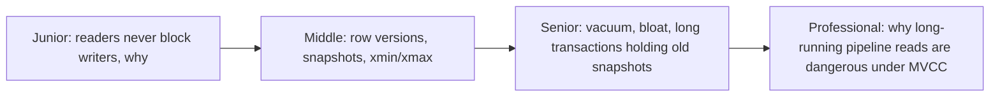
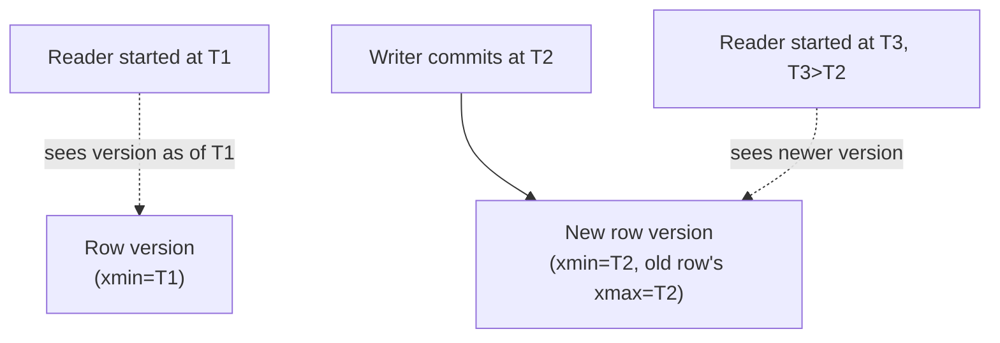

# MVCC (Multi-Version Concurrency Control)

> Instead of making readers wait for writers, keep multiple versions of each
> row around and hand each transaction the version that matches its own
> snapshot in time. This is why a long-running analytical query never blocks
> — or gets blocked by — the application writing to the same table.

## Choose a level

| Level | Guide | You are done when |
|---|---|---|
| Junior | [Why readers never block writers](junior.md) | You can explain, without jargon, why a `SELECT` doesn't wait for a concurrent `UPDATE` under MVCC. |
| Middle | [Row versions and snapshots](middle.md) | You can trace `xmin`/`xmax` through a concrete Postgres example. |
| Senior | [Vacuum, bloat, and long transactions](senior.md) | You can explain why an old open transaction can bloat a table and slow down every query. |
| Professional | [Long pipeline reads under MVCC](professional.md) | You can design a long-running extraction query so it doesn't accidentally block vacuum or bloat the source. |

## Practice rule

Next time you run a query that takes minutes against a live OLTP table, ask:
"is this transaction still holding open a snapshot the whole time, and what
does that do to every row that gets updated or deleted elsewhere in the
meantime?" That question is the entire subject of `senior.md`.

## Related

- [Isolation Levels](../08-isolation-levels/README.md)
- [Locking & Concurrency Control](../09-locking-and-concurrency-control/README.md)
- [Transactions & ACID](../07-transactions-and-acid/README.md)
