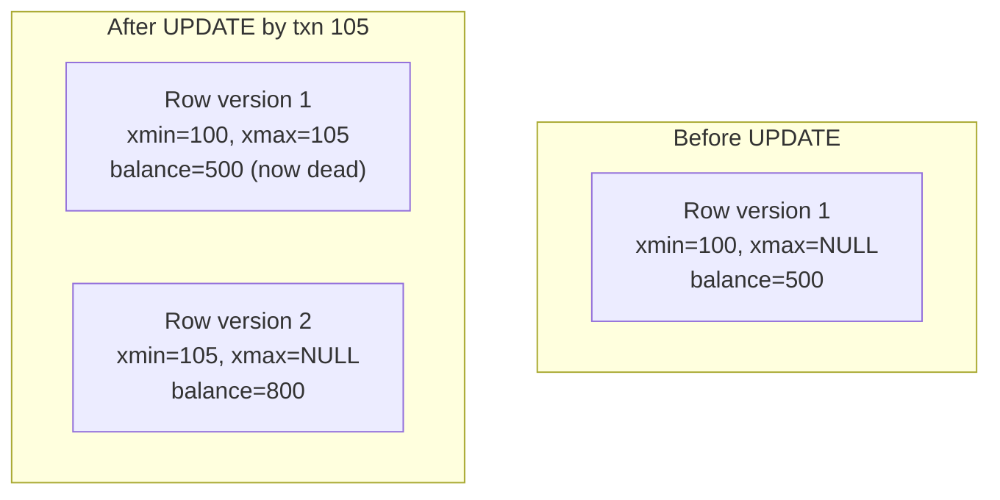

# MVCC — Middle

<!-- level-focus -->
At middle level, focus on this question:

> How does the database actually track which transaction should see which
> row version?

Prerequisite: [`junior.md`](junior.md).

---

## `xmin` and `xmax` (Postgres's implementation)

Every row physically stores two hidden columns: `xmin` (the ID of the
transaction that created this version) and `xmax` (the ID of the transaction
that deleted/superseded it, or empty if it's still current).



An `UPDATE` in Postgres never modifies a row in place — it marks the old
version's `xmax` as the updating transaction's ID (making it "dead" but not
yet removed) and inserts a brand-new row version with its own `xmin`. A
`DELETE` just sets `xmax`; it doesn't physically remove anything immediately.

## Visibility rule (simplified)

A transaction with snapshot ID `S` can see a row version if:

```
xmin is committed AND xmin <= S
AND (xmax is NULL OR xmax is not yet committed OR xmax > S)
```

In plain terms: "this version was created by a transaction that had already
committed by the time my snapshot started, and it hadn't yet been
superseded/deleted as of my snapshot." This single rule is what lets every
transaction compute, independently, exactly which row versions belong to
*its* view of the world — no coordination with other transactions required at
read time.

## Multiple versions pile up

```sql
BEGIN;
UPDATE accounts SET balance = 600 WHERE id = 'A';  -- version 2, xmin=101
UPDATE accounts SET balance = 700 WHERE id = 'A';  -- version 3, xmin=101 (same txn)
COMMIT;
```

Even within a single transaction, some engines create intermediate versions.
Across many transactions over time, a frequently-updated row can accumulate
dozens of dead versions before anything cleans them up. That cleanup —
**vacuum** — and what happens when it falls behind, is `senior.md`'s subject.

## Test yourself

1. Using the visibility rule, explain why a transaction that started before
   an `UPDATE` committed still sees the old version, even after the `UPDATE`
   commits.
2. Why does an MVCC `DELETE` not immediately free the row's storage?
3. If a row is updated 1,000 times between two vacuum runs, how many physical
   versions of that row might exist on disk at once, in the worst case?

Continue to [`senior.md`](senior.md).
