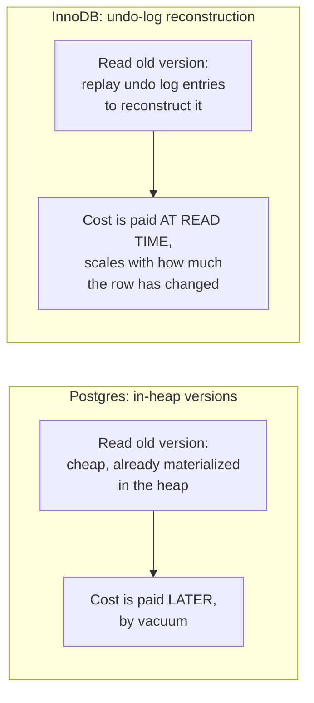

# MVCC — Professional

<!-- level-focus -->
At professional level, focus on this question:

> How do different databases actually implement multi-versioning under the
> hood, and what operational failure modes are unique to each
> implementation at scale?

Prerequisite: [`senior.md`](senior.md).

---

## Three MVCC implementation families

| Family | Where old versions live | Representative system |
|---|---|---|
| **Append-only, in-table versioning** | Old and new tuple versions coexist in the same heap; `vacuum` reclaims dead ones later | Postgres |
| **Undo-log-based versioning** | Only the latest version lives in the table; old versions are reconstructed on demand from an undo log | InnoDB (MySQL), Oracle |
| **Copy-on-write, external history** | Old versions are moved to a separate rollback/history structure entirely | Oracle's UNDO tablespace (a refined version of the undo-log family), SQL Server's `READ_COMMITTED_SNAPSHOT` via `tempdb` version store |

Postgres's approach makes **reads of old versions free** (they're just other
rows in the same heap, found via the normal visibility check) but makes
**vacuum a mandatory, ongoing cost** to prevent the table from growing
unboundedly with dead versions. InnoDB's approach keeps the primary table
compact (only current versions) but makes **reading an old version
expensive** — a long-running transaction under `REPEATABLE READ` forces
InnoDB to walk the undo log chain, reconstructing the row as it existed at
snapshot time, which gets progressively slower the more the row has changed
since — a mechanism entirely invisible in Postgres, where the old version is
just sitting there already materialized.



## Postgres internals: freeze, XID wraparound, and the two-billion-transaction wall

Postgres transaction IDs (XIDs) are 32-bit and compared with **wraparound
arithmetic** — a design decision requiring that "old enough" tuples be
**frozen** (marked as permanently visible to all future transactions,
independent of XID comparison) before the XID counter wraps around and old
XIDs would appear to be "in the future" relative to new ones, silently
making committed data invisible. `autovacuum_freeze_max_age` (default
200 million transactions) forces an aggressive **anti-wraparound vacuum**
that cannot be cancelled or deferred once the table crosses this age — a
staff-level operational fact many teams learn only when a huge anti-wraparound
vacuum unexpectedly saturates I/O on a production primary during a
high-traffic period, because nobody scheduled proactive vacuuming to stay
ahead of the threshold.

## InnoDB internals: the purge thread and the undo tablespace ceiling

InnoDB's **purge thread** is a background process (or thread pool, in
modern MySQL) responsible for removing undo log entries and delete-marked
rows once no active transaction's snapshot could still need them —
InnoDB's direct structural analog to Postgres's vacuum. Under sustained
high write load with a long-running transaction present, purge falls
behind and the undo tablespace grows — in cloud-managed MySQL
(RDS/Aurora), this has historically caused **disk-full incidents** distinct
from Postgres's failure mode (Postgres bloats the *table itself*; InnoDB
bloats the *undo tablespace*, potentially while the main table stays a
normal size, making the growth harder to spot from table-size monitoring
alone).

## Scale failure modes, concretely

| Symptom | Postgres mechanism | InnoDB mechanism |
|---|---|---|
| A long-idle transaction degrades unrelated query performance cluster-wide | Vacuum horizon pinned; dead tuples accumulate across ALL tables, not just ones the idle transaction touched | Purge lags; undo tablespace grows; row-history reconstruction cost rises for any transaction reading recently-modified rows |
| Sudden, unscheduled multi-hour maintenance window with heavy I/O | Anti-wraparound autovacuum forced at `autovacuum_freeze_max_age`, cannot be deferred | Rare direct analog — but a purge backlog clearing under sudden load reduction can spike I/O similarly |
| Disk usage grows despite table row counts looking stable | Table/index bloat from unreclaimed dead tuples | Undo tablespace growth, often invisible in naive "table size" dashboards |

## Production checklist (staff-level)

1. **Monitor Postgres transaction ID age (`age(datfrozenxid)`) as a leading
   indicator**, not just table bloat — schedule proactive vacuum before
   hitting `autovacuum_freeze_max_age` under load, never let it trigger
   unscheduled during peak traffic.
2. **Monitor InnoDB undo tablespace size and purge lag
   (`information_schema.innodb_trx` history list length) separately from
   main table size** — undo bloat is invisible to naive table-size
   dashboards and is the InnoDB-specific analog of Postgres bloat.
3. **Set explicit `idle_in_transaction_session_timeout` (Postgres) and
   equivalent connection-level timeouts (MySQL) in production**, not just as
   a defensive default — this is the single highest-leverage guardrail
   against both failure families.
4. **When reviewing a schema/access pattern for a row expected to be
   updated very frequently and also read by long-running analytical
   transactions**, flag it explicitly on InnoDB — the undo-chain
   reconstruction cost for reading an old version of a heavily-modified row
   is a real, measurable tax that doesn't exist the same way on Postgres.
5. **In a capacity-planning review, size storage headroom for the specific
   bloat mechanism of your engine** — Postgres needs headroom for table/index
   bloat between vacuum cycles; InnoDB needs headroom for undo tablespace
   growth during purge lag, and these have different growth-rate profiles
   under the same workload.

## Cheat Sheet

```text
+------------------------------------------------------------------+
|                  MVCC — INTERNALS & SCALE                           |
+------------------------------------------------------------------+
| Postgres: in-heap append-only versions, reads of old versions are     |
| FREE, cost deferred to VACUUM. 32-bit XID wraparound forces           |
| mandatory anti-wraparound vacuum at autovacuum_freeze_max_age -        |
| cannot be deferred, can hit unscheduled during peak load               |
+------------------------------------------------------------------+
| InnoDB: compact table, old versions reconstructed on demand from       |
| the UNDO LOG - reading an old version of a heavily-modified row       |
| costs MORE (undo chain replay). PURGE THREAD is the vacuum analog,    |
| bloats the UNDO TABLESPACE (often invisible in table-size metrics)    |
+------------------------------------------------------------------+
| Both: a long-open transaction pins the reclamation horizon for        |
| EVERY table, not just the ones it touches - set idle-in-transaction   |
| timeouts as a default guardrail, not an afterthought                  |
+------------------------------------------------------------------+
```

## Test yourself

1. Why does reading an old row version cost essentially nothing extra in
   Postgres but can cost meaningfully more in InnoDB, as a row is modified
   more times between the snapshot and the read?
2. A Postgres cluster suddenly triggers an unscheduled multi-hour vacuum
   during peak traffic. What threshold was crossed, and how would you have
   prevented it from happening unscheduled?
3. An RDS MySQL instance's disk usage grows steadily while
   `information_schema.tables` shows stable table sizes. What's the likely
   cause, and what would you check?

## Further Reading

- PostgreSQL documentation — "Preventing Transaction ID Wraparound Failures"
  and "Routine Vacuuming."
- MySQL/InnoDB documentation — "InnoDB Multi-Versioning" and "InnoDB Undo
  Logs" (purge thread internals).
- Peter Zaitsev (Percona) — engineering blog posts on InnoDB history list
  length and undo tablespace growth incidents.
- See also: [Transactions & ACID — professional](../07-transactions-and-acid/professional.md),
  [Isolation Levels — professional](../08-isolation-levels/professional.md).
