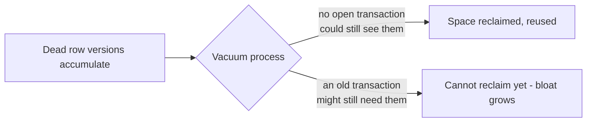
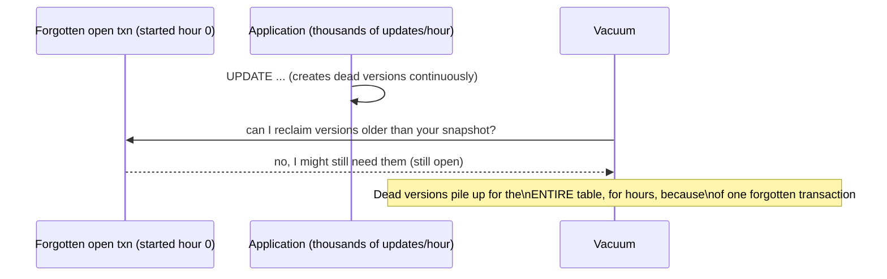

# MVCC — Senior

<!-- level-focus -->
At senior level, focus on this question:

> Why can a single long-running transaction slow down an entire database,
> even if it only ever reads?

Prerequisite: [`middle.md`](middle.md).

---

## Vacuum: MVCC's garbage collector

Dead row versions (superseded by an `UPDATE`, or removed by a `DELETE`) don't
disappear immediately — they take up disk space and the query planner still
has to skip past them when scanning. **Vacuum** is the background process
that reclaims dead versions once no transaction could possibly need them
anymore.



## The long-running transaction problem

Vacuum can only reclaim a dead version once **every currently-open
transaction's snapshot** is newer than that version's `xmax`. A single
transaction left open for hours — a forgotten interactive session, a stuck
analytical query, a batch job that opened a transaction and then did slow
external I/O before committing — pins vacuum's cleanup horizon at that old
transaction's start time.



The result: **table bloat** (the table on disk grows far beyond its logical
data size), degraded query performance (every scan wades through dead
versions), and in the worst case, transaction ID wraparound risk on very old,
very busy tables. This is why "a query is just reading, it can't hurt
anything" is a dangerous assumption under MVCC — a read-only transaction left
open is exactly as damaging to vacuum's progress as a write-heavy one.

## Diagnosing it

```sql
-- Postgres: find long-running or idle-in-transaction sessions
SELECT pid, state, now() - xact_start AS duration, query
FROM pg_stat_activity
WHERE state != 'idle' AND xact_start IS NOT NULL
ORDER BY duration DESC;
```

`idle in transaction` is the specific state to watch for: a connection that
opened a transaction, ran a query, and then sat there — application code
forgot to commit/rollback, or is waiting on something external mid-transaction.

> 🎯 **Senior takeaway:** MVCC removes reader/writer blocking, but replaces it
> with a different shared resource: **the oldest open snapshot in the
> system.** One forgotten long-running transaction anywhere in the database
> degrades every other query's performance, because vacuum can't advance past
> it.

## Test yourself

1. Why does a purely read-only transaction still block vacuum's progress,
   even though it never creates any dead versions itself?
2. What operational practice would you put in place to catch an
   `idle in transaction` session before it causes bloat, rather than after?
3. Explain, to a teammate who says "it's just a SELECT, it can't cause
   problems," exactly why they're wrong under MVCC.

Continue to [`professional.md`](professional.md) to design pipeline
extraction queries that don't trigger this problem against a production
source.
