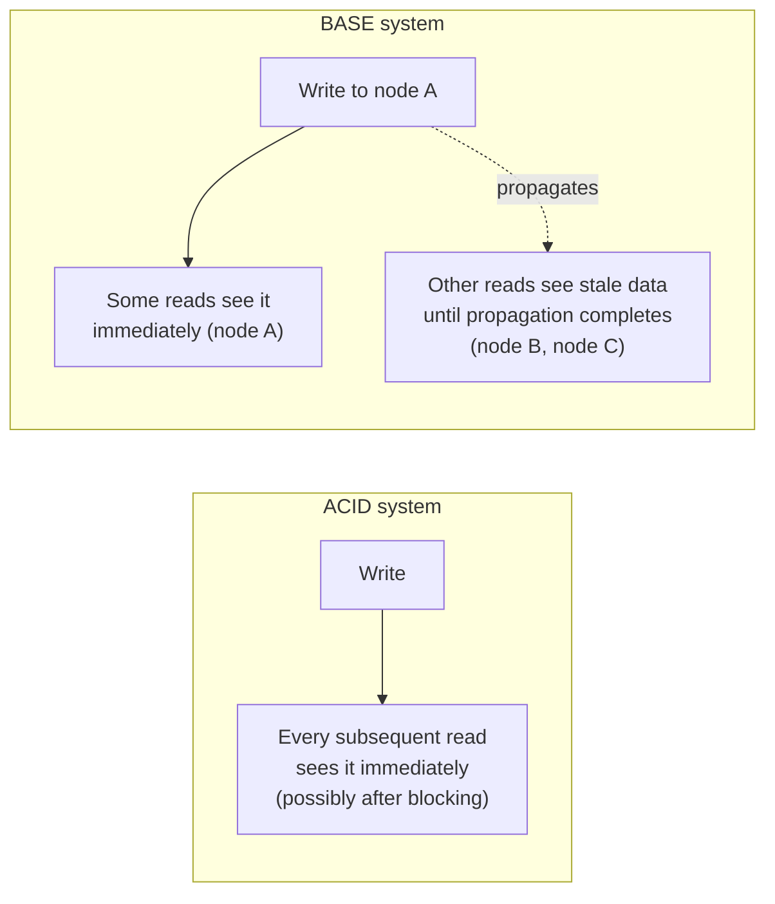

# BASE & Eventual Consistency — Junior

<!-- level-focus -->
At junior level, focus on this question:

> What does BASE give up compared to ACID, and why would any system choose
> that on purpose?

---

## BASE, word by word

| Word | Meaning | Contrast with ACID |
|---|---|---|
| **Basically Available** | The system responds to every request, even during a failure or partition — possibly with stale or approximate data. | ACID systems may block or reject a request rather than serve inconsistent data. |
| **Soft state** | The system's state may change over time even without new input, as replicas converge. | ACID systems have a definite, immediately-settled state after each commit. |
| **Eventually consistent** | If no new writes occur, all replicas will *eventually* return the same value. | ACID's Isolation guarantees a precise, immediate view — no "eventually" involved. |

## Why choose this on purpose?

A single-node ACID database can't survive a network partition and stay both
available and consistent (this is the CAP theorem — see
[CAP Theorem](../../distributed-system/02-tradeoffs-framework/01-cap-theorem/junior.md)).
Systems built to span multiple data centers or survive node failures without
downtime (Cassandra, DynamoDB, S3, most CDNs) choose **availability** over
strict consistency, and BASE describes the resulting contract with
application developers: "you will always get an answer, but it might be a
few moments out of date."

> 🎓 **Takeaway:** BASE isn't a lesser version of ACID — it's a different set
> of priorities for a different problem: systems that must keep serving
> traffic even when part of the network is unreachable, at the cost of a
> brief window where different replicas disagree.

## Test yourself

1. Give one real system you've used (as a user, not an engineer) where you've
   personally noticed eventual consistency (e.g. a "like" count that takes a
   moment to update everywhere).
2. Why can't a single-node relational database "choose" BASE — what has to be
   true about a system's architecture before BASE becomes a relevant choice
   at all?
3. What does "soft state" mean for data you've written but hasn't yet
   propagated everywhere — is it wrong, or just not-yet-everywhere?

Continue to [`middle.md`](middle.md).
