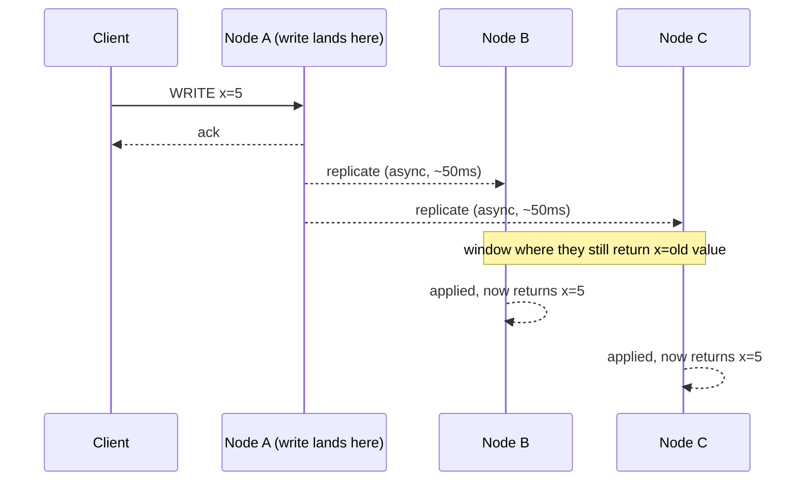
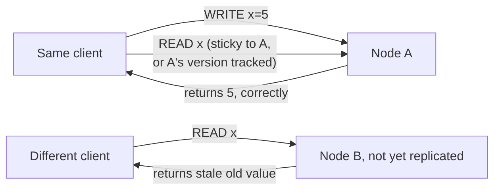

# BASE & Eventual Consistency — Middle

<!-- level-focus -->
At middle level, focus on this question:

> What does "eventually" actually mean, and what stronger guarantee
> ("read-your-writes") sits between eventual consistency and full ACID
> isolation?

Prerequisite: [`junior.md`](junior.md).

---

## "Eventually" is a real, bounded window in practice

"Eventually consistent" sounds unbounded, but production systems almost
always have a **practical convergence window** driven by replication
mechanics: gossip protocol round-trip time, replication lag, or a
configured anti-entropy interval.

The engineering question is never "is this system eventually consistent" —
almost every distributed store technically is. It's **"what is the
convergence window under normal operation, and under degraded conditions
(node down, network partition)?"** — a number you should get from the specific
system's documentation or your own measurements, not assume.

## Read-your-writes consistency

A common, weaker-than-strict but stronger-than-plain-eventual guarantee: **a
client that just wrote a value will see that value on its own subsequent
reads**, even if other clients might still see stale data from other
replicas.

Implementations achieve this by **session stickiness** (route the same
client's reads back to the node it wrote to) or by having the client track a
version/token from its write and requiring reads to be "at least as new" as
that token. Without this, a user updating their own profile and immediately
reloading the page could see their own change vanish — a UX bug, not a
correctness violation of eventual consistency's actual contract, but a common
source of "the database is broken" bug reports.

## Test yourself

1. Why is "eventually consistent" not a useful enough answer on its own for
   an SLA — what number should you ask for instead?
2. How does read-your-writes consistency differ from full linearizability
   (every client always sees the latest write, immediately)?
3. A user edits their profile and the change appears to "disappear" on
   refresh, then reappears 2 seconds later. Which guarantee was missing?

Continue to [`senior.md`](senior.md) to see what happens when two clients
write concurrently to different replicas.
