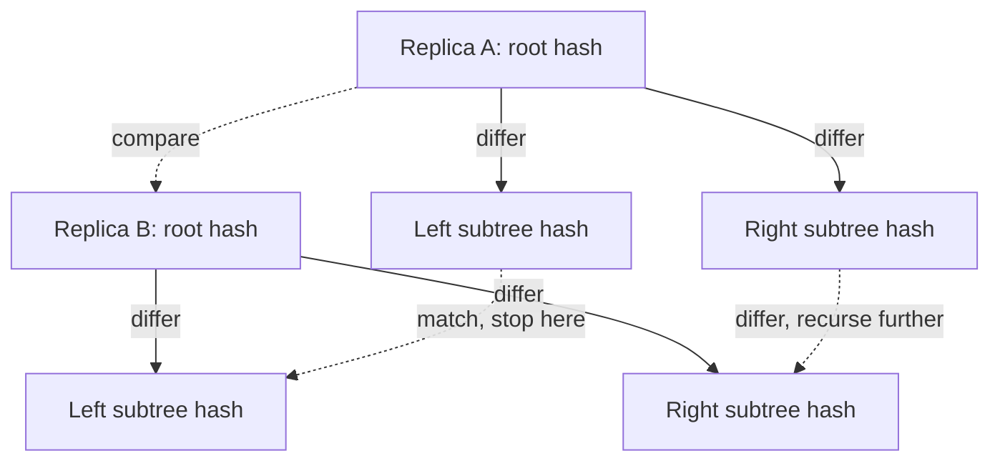

# BASE & Eventual Consistency — Professional

<!-- level-focus -->
At professional level, focus on this question:

> What do the actual anti-entropy mechanisms (Merkle trees, vector clocks,
> CRDTs in production) look like inside real distributed systems, and where
> do they fail at scale?

Prerequisite: [`senior.md`](senior.md).

---

## Anti-entropy via Merkle trees: how replicas actually reconcile

Dynamo-style systems (Cassandra, Riak, DynamoDB's internal replication)
detect and repair divergence between replicas using **Merkle trees**: each
replica builds a tree of hashes over its data, leaves hashing small key
ranges and internal nodes hashing the concatenation of their children. Two
replicas compare trees top-down — if root hashes match, the replicas are
identical for that entire range and comparison stops immediately; if they
differ, the comparison recurses into children, narrowing down to the
specific key ranges that actually diverged, without transferring or hashing
the entire dataset for every repair cycle.



The staff-level cost model: Merkle tree comparison is **O(log N)** in the
number of divergent ranges to *locate*, but the actual **repair transfer
cost is O(divergence size)** — a small, localized divergence (a brief
network partition affecting a few keys) repairs cheaply and fast; a
long-running silent divergence (a node that's been partially unreachable for
days, per the hint-window discussion in the NoSQL Modeling professional
page) can require rebuilding a Merkle tree over the *entire* dataset on both
sides before any comparison can even begin — a `nodetool repair` on a large,
significantly diverged Cassandra cluster is a well-known multi-hour-to-multi-day
operation, not a quick reconciliation.

## Vector clocks in production: the size-growth problem Dynamo's own paper flags

A vector clock tracks one counter per node that has ever written a given
key: `{nodeA: 3, nodeB: 1, nodeC: 0}`. In a cluster with high node churn
(frequent scaling events, ephemeral nodes in a containerized deployment),
the vector clock's size grows with the number of **distinct nodes that have
ever touched the key**, not the current cluster size — Amazon's own Dynamo
paper explicitly flags this as an open problem and describes a **pruning
strategy** (dropping the oldest clock entries past a size/age threshold),
which trades perfect causal history for bounded metadata size — a real,
acknowledged correctness compromise made for operability, not a theoretical
footnote.

## CRDTs in production: Riak's and Redis's actual implementations

Riak's **data types** (counters, sets, maps) are production CRDT
implementations built on top of **dotted version vectors** (an optimization
over plain vector clocks that avoids the "sibling explosion" problem where
naive concurrent-write handling creates an unbounded number of conflicting
versions for the same key). Redis's **CRDT-based Active-Active** (Redis
Enterprise) implements conflict-free replication for multi-region write
availability using a similar causal-metadata approach, but explicitly
documents that certain operations (e.g. certain Sorted Set score updates
under specific concurrent patterns) fall back to last-write-wins semantics
because a fully general CRDT merge isn't definable for that operation —
a concrete instance of `senior.md`'s "not every business object fits a CRDT"
becoming a documented production limitation, not just a theoretical caveat.

## Scale failure modes, concretely

| Symptom | Root cause | Diagnostic |
|---|---|---|
| A cluster repair (`nodetool repair`) that used to take an hour now takes 18 hours | Divergence accumulated over a long partial outage exceeded the hint window; full Merkle tree rebuild + large data transfer required, not a localized comparison | Compare repair duration trend against total node uptime/outage history, not just cluster size growth |
| A frequently-updated key's metadata size grows unexpectedly, degrading read/write latency for that key specifically | Vector clock growth from node churn without pruning configured, or pruning threshold set too high | Per-key metadata size sampling; Dynamo-style systems often expose this via a diagnostic API or admin tool |
| A CRDT-based counter/set shows unexpected LWW-style data loss under concurrent multi-region writes | The specific operation used doesn't have a defined CRDT merge and silently falls back to LWW — a documented but easy-to-miss system limitation | Check the specific data type/operation's documented conflict-resolution semantics, not the system's general "CRDT-based" marketing claim |

## Production checklist (staff-level)

1. **Budget repair/anti-entropy time against realistic outage/partition
   scenarios, not steady-state**, since repair cost scales with divergence
   size, which scales with outage duration — a capacity plan based on
   steady-state repair times will be badly wrong during an actual incident.
2. **Configure and monitor vector clock/version-vector pruning explicitly**
   in any system exposed to node churn — don't rely on defaults without
   understanding the correctness trade-off being made.
3. **Read the specific documented conflict-resolution semantics for every
   operation you use on a "CRDT-based" system**, not just the system's
   overall marketing claim — the general property doesn't always extend to
   every specific API call.
4. **Track repair/anti-entropy duration trend over time as a leading
   indicator**, alerting on unexpected growth before it becomes an
   availability incident during the next real partition.
5. **In a postmortem for unexpected data loss on a "CRDT" system**, check
   for LWW fallback on the specific operation involved before assuming a
   bug — this is a documented, known trade-off in several production CRDT
   implementations, not necessarily a defect.

## Cheat Sheet

```text
+------------------------------------------------------------------+
|         BASE & EVENTUAL CONSISTENCY — INTERNALS & SCALE              |
+------------------------------------------------------------------+
| Anti-entropy via MERKLE TREES: O(log N) to LOCATE divergence,         |
| O(divergence size) to REPAIR - long partial outages cause full-tree   |
| rebuilds and multi-hour/day repairs, not quick reconciliation          |
+------------------------------------------------------------------+
| Vector clocks GROW with distinct nodes that ever wrote a key           |
| (not current cluster size) - Dynamo paper flags this, prod systems    |
| implement PRUNING (bounded metadata, imperfect causal history)        |
+------------------------------------------------------------------+
| Production CRDTs (Riak, Redis Active-Active) use dotted version        |
| vectors to avoid sibling explosion - but NOT every operation has a     |
| defined CRDT merge; some silently fall back to LWW (documented, but   |
| easy to miss)                                                          |
+------------------------------------------------------------------+
| Capacity-plan repair time against OUTAGE scenarios, not steady state   |
+------------------------------------------------------------------+
```

## Test yourself

1. Why does Merkle-tree-based repair cost scale with divergence size rather
   than total dataset size in the common case, and why does that assumption
   break down after a long partial outage?
2. Explain the vector-clock pruning trade-off Dynamo's paper describes —
   what correctness property is given up, and why is it acceptable in
   practice?
3. A team relying on a "CRDT-based" data store experiences unexpected data
   loss on concurrent writes to a specific field. What's the first thing
   you'd check before filing it as a bug?

## Further Reading

- DeCandia et al. — "Dynamo: Amazon's Highly Available Key-value Store"
  (Merkle trees, vector clock pruning — read this specifically for the
  "known limitations" sections, not just the headline design).
- Basho/Riak documentation — "Dotted Version Vectors" and Riak Data Types
  (production CRDT implementation details).
- Redis Enterprise documentation — "Active-Active (CRDB)" conflict
  resolution semantics per data type.
- See also: [NoSQL Modeling — professional](../../data-modeling/03-nosql-modeling/professional.md).
