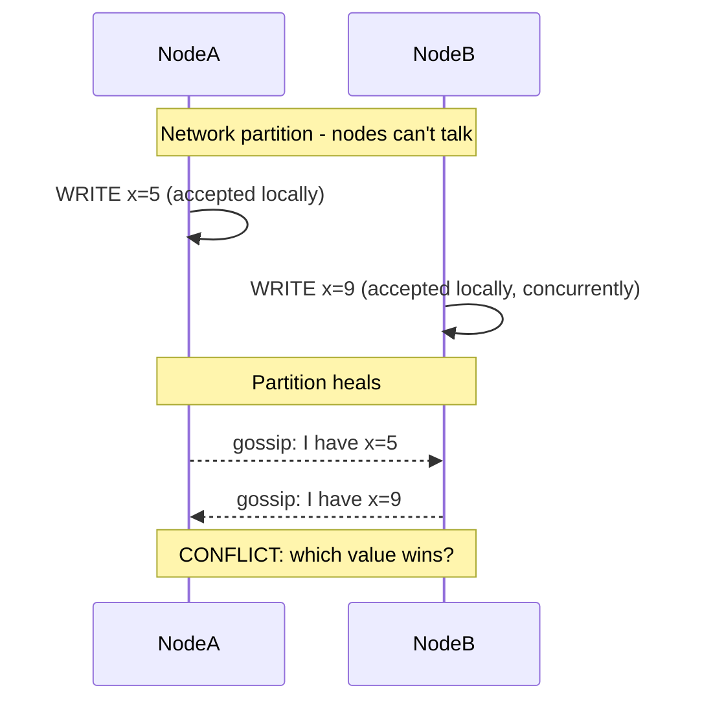
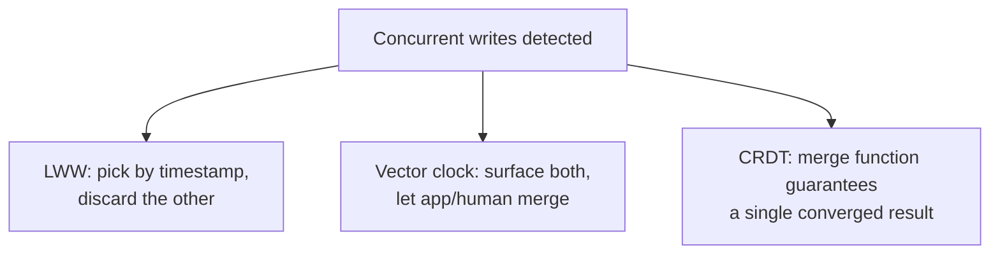

# BASE & Eventual Consistency — Senior

<!-- level-focus -->
At senior level, focus on this question:

> Two replicas each accept a concurrent write to the same key while
> partitioned from each other. When they reconnect, how is the conflict
> resolved?

Prerequisite: [`middle.md`](middle.md).

---

## The conflict scenario



Both writes were locally valid — availability during a partition means each
side kept accepting writes independently. There is no way to know, after the
fact, which "should" have won without a policy.

## Resolution strategies

| Strategy | How it decides | Trade-off |
|---|---|---|
| **Last-Write-Wins (LWW)** | Attach a timestamp to each write; highest timestamp wins, the other is silently discarded. | Simple, but **data loss** is explicit — if clocks are skewed, "last" may not even be chronologically last. Cassandra and DynamoDB use this by default for simple types. |
| **Vector clocks** | Track a per-node counter vector with each write; if neither write's vector "happened before" the other, both are surfaced as siblings for the application (or a merge function) to resolve. | No silent data loss — but pushes the resolution decision to the application, and vectors grow with the number of nodes involved. |
| **CRDTs (Conflict-free Replicated Data Types)** | Design the data type itself (a counter, a set, a map) so that *any* merge order of concurrent updates converges to the same, mathematically well-defined result — no arbitrary "winner" needed. | Requires modeling your data as a CRDT-compatible type; not every business object fits naturally (e.g. "who deleted this row" doesn't always compose cleanly). |



## Worked CRDT example: a G-Counter (grow-only counter)

```
Node A's local count: {A: 5, B: 0, C: 0}
Node B's local count: {A: 0, B: 3, C: 0}

Merge (element-wise max): {A: 5, B: 3, C: 0}
Total = sum of all elements = 8
```

Each node tracks its own increments separately; merging takes the max per
node, never loses an increment, and always converges to the same total
regardless of merge order — this is what makes a distributed "like counter"
or "view counter" safe to implement without coordination.

> 🎯 **Senior takeaway:** conflict resolution strategy is a modeling decision
> made **before** you pick a store, not a knob you tune afterward. LWW is
> fine for data where losing the "losing" write is acceptable (a cache, a
> presence flag); anything where losing a write is a real business problem
> (inventory counts, financial balances) needs vector clocks, CRDTs, or a
> stronger consistency model entirely.

## Test yourself

1. Why can LWW silently lose data even when both writes were individually
   valid and intentional?
2. Design a CRDT-style approach for a distributed "add to cart" feature where
   two devices add items to the same cart while offline.
3. What does a vector clock detect that a simple timestamp cannot?

Continue to [`professional.md`](professional.md) to design pipelines that
correctly handle sources with these consistency semantics.
