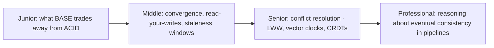
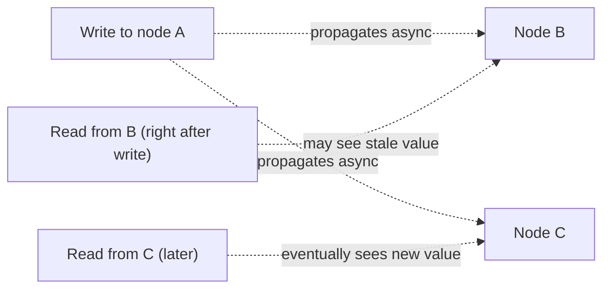

# BASE & Eventual Consistency

> BASE is ACID's counterpart for systems that chose availability and
> partition tolerance over strict consistency: Basically Available, Soft
> state, Eventually consistent. Most distributed data-platform components
> (Kafka, Cassandra, S3, DynamoDB) live here, not in ACID's world.

## Choose a level

| Level | Guide | You are done when |
|---|---|---|
| Junior | [What BASE trades away](junior.md) | You can explain BASE's three words and contrast them against ACID's four letters. |
| Middle | [Convergence and staleness](middle.md) | You can explain what "eventually" means precisely, and what read-your-writes consistency adds on top. |
| Senior | [Conflict resolution](senior.md) | You can compare last-write-wins, vector clocks, and CRDTs for resolving concurrent writes. |
| Professional | [Reasoning about it in pipelines](professional.md) | You can design a pipeline that tolerates eventual consistency in its sources without producing wrong aggregates. |

## Practice rule

Next time you read from a distributed store right after writing to it, ask:
"does this specific read path guarantee it sees my own write, or could it hit
a different replica that hasn't caught up yet?" If you don't know, you don't
yet understand this store's consistency model well enough to build on it.

## Related

- [Transactions & ACID](../transactions-and-acid/README.md)
- [CAP Theorem](../../distributed-system/02-tradeoffs-framework/cap-theorem/README.md)
- [Consistency Models](../../distributed-system/02-tradeoffs-framework/consistency-models/README.md)
