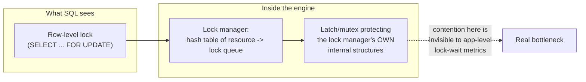
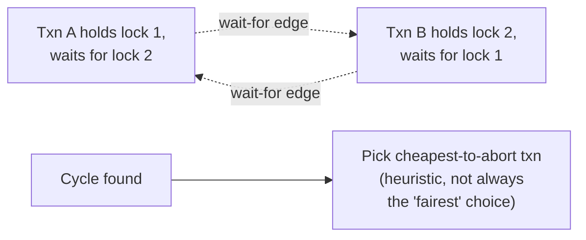

# Locking & Concurrency Control — Professional

<!-- level-focus -->
At professional level, focus on this question:

> What does a lock actually look like in memory inside a database engine,
> and how do real systems avoid the lock manager itself becoming the
> bottleneck at high concurrency?

Prerequisite: [`senior.md`](senior.md).

---

## The lock manager is a shared data structure with its own scalability limits

Every lock request goes through a **lock manager**: an in-memory hash table
keyed by resource identifier (a row's TID/ctid in Postgres, a page/record
identifier in InnoDB), storing a queue of granted and waiting lock requests
per resource. This structure is itself protected by lower-level
**latches/mutexes** (short-lived spinlocks guarding the lock manager's own
internal state, distinct from the logical row/table locks visible to SQL).
At extreme concurrency, **latch contention on the lock manager's own hash
buckets** can become the actual bottleneck — a system can show low "lock
wait" time in application-level monitoring while still being throughput-limited
by internal latch contention invisible above the storage engine layer.



## Lock escalation: when row locks become a table lock

SQL Server (and, differently, older MySQL MyISAM-era engines) implements
**lock escalation**: if a transaction accumulates enough individual row/page
locks (a configurable threshold, historically ~5,000 locks in SQL Server),
the engine converts them into a single coarser table-level lock to reduce
lock-manager memory and CPU overhead. This is an engine-internal
optimization decision that can **silently degrade concurrency** — a bulk
update that starts with fine-grained row locks can escalate mid-transaction
into a table lock that blocks unrelated concurrent transactions that would
have been unaffected by the original row-level locking. Postgres and InnoDB
do not implement lock escalation this way; MVCC-heavy engines avoid the
problem differently by relying on version visibility instead of exclusive
locks for most reads.

## Deadlock detection: wait-for graphs vs. timeout-based approaches

- **Graph-based (Postgres, InnoDB)**: the engine maintains a **wait-for
  graph** (transaction A waits for a lock held by B) and periodically (or
  on each new wait) runs cycle detection. On finding a cycle, it aborts the
  transaction that would be "cheapest" to roll back (heuristically, often
  the one with the least work done, or simply the one that triggered the
  detection). Detection cost scales with the number of concurrently waiting
  transactions — pathological under very high lock contention, since cycle
  detection itself becomes CPU work competing with the transactions it's
  trying to unblock.
- **Timeout-based (some distributed/NewSQL systems, and as a fallback even
  in graph-based engines via `lock_timeout`)**: simpler, avoids the graph
  maintenance cost, but can abort transactions that weren't actually
  deadlocked — just slow — producing false-positive aborts under load spikes
  that aren't true deadlocks at all.



## Real-world failure mode: latch contention masquerading as "lock contention"

A classic staff-level misdiagnosis: application-level metrics show elevated
query latency and even show "waiting on locks" in `pg_stat_activity` or
`SHOW ENGINE INNODB STATUS`, but the actual root cause is a **hot page or
hot index leaf latch** — many transactions hitting the same B+Tree leaf page
(e.g. inserting into a monotonically-increasing index, ironically the exact
"good" pattern from the B+Tree professional page for split behavior, but
still a single hot page under extreme insert concurrency) contend on the
short-lived latch protecting that page's in-memory buffer, not on any
row-level SQL lock at all. This is diagnosed via engine-internal wait-event
instrumentation (Postgres's `pg_stat_activity.wait_event` with
`LWLock`/`BufferContent` events; InnoDB's `SHOW ENGINE INNODB MUTEX`), not
via ordinary lock-wait queries.

## Production checklist (staff-level)

1. **Distinguish logical lock contention from internal latch contention
   using engine-specific wait-event instrumentation** before concluding
   "we need finer-grained locking" — the fix for each is completely
   different.
2. **Know whether your engine implements lock escalation**, and if so,
   monitor for it explicitly (SQL Server's `sys.dm_tran_locks` escalation
   events) — a bulk operation silently escalating to a table lock is a
   frequent, hard-to-reproduce production incident.
3. **Understand your engine's deadlock victim-selection heuristic** before
   relying on "the deadlock detector will handle it" — if your application
   assumes a specific transaction always wins, verify that assumption
   against the actual heuristic, don't guess.
4. **For extreme-insert-rate workloads on monotonic keys, watch for hot-page
   latch contention specifically**, and consider techniques that
   deliberately introduce controlled key dispersion (hash-prefixing,
   sequence-sharding) to spread the hot page across multiple physical pages —
   trading some B+Tree insert locality for reduced latch contention.
5. **In a lock-contention postmortem, always pull the engine's internal
   wait-event breakdown first**, not just application-level slow-query logs —
   the human-readable symptom ("query X is slow") frequently points at the
   wrong layer entirely.

## Cheat Sheet

```text
+------------------------------------------------------------------+
|         LOCKING & CONCURRENCY CONTROL — INTERNALS & SCALE            |
+------------------------------------------------------------------+
| Lock manager = in-memory hash table (resource -> lock queue),         |
| itself protected by LATCHES - latch contention on lock-manager         |
| internals can bottleneck the system while looking like "no lock       |
| waits" at the application level                                       |
+------------------------------------------------------------------+
| Lock escalation (SQL Server): many row locks -> ONE table lock,        |
| silently reduces concurrency mid-transaction. Postgres/InnoDB          |
| avoid this via MVCC visibility instead of exclusive-lock reliance     |
+------------------------------------------------------------------+
| Deadlock detection: wait-for graph + cycle detection (Postgres,        |
| InnoDB) vs. timeout-based (simpler, false-positive risk under load)   |
| Victim selection is a HEURISTIC - don't assume which txn "wins"       |
+------------------------------------------------------------------+
| Hot-page/index-leaf LATCH contention can masquerade as lock            |
| contention under extreme insert concurrency on monotonic keys -        |
| diagnose via wait_event/LWLock instrumentation, not lock-wait queries |
+------------------------------------------------------------------+
```

## Test yourself

1. A system shows no elevated row-lock wait time but has degraded write
   throughput under high concurrent insert load into a monotonically
   increasing index. What would you check, and why might the fix involve
   deliberately reducing key locality?
2. Why can lock escalation cause a bulk `UPDATE` to unexpectedly block
   unrelated transactions mid-run, on an engine that supports it?
3. Your deadlock detector aborts a transaction you expected to "win" based
   on business logic priority. What does this tell you about the engine's
   victim-selection heuristic, and how would you enforce your actual
   priority instead?

## Further Reading

- Jim Gray & Andreas Reuter — *Transaction Processing: Concepts and
  Techniques* (lock manager internals, deadlock detection algorithms).
- PostgreSQL source — `src/backend/storage/lmgr/` (the actual lock manager
  and LWLock implementation).
- Microsoft SQL Server documentation — "Lock Escalation (Database Engine)."
- See also: [Isolation Levels — professional](../isolation-levels/professional.md),
  [B+Tree — professional](../../performance/14-indexing%20%26%20filtering/b+tree/professional.md).
