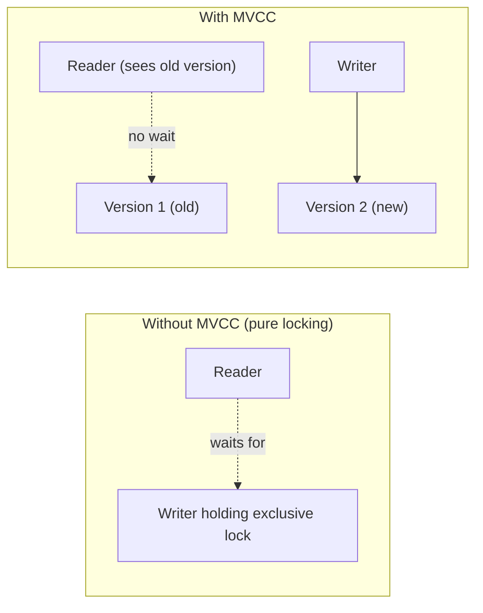

# MVCC — Junior

<!-- level-focus -->
At junior level, focus on this question:

> Why can a `SELECT` run at full speed while an `UPDATE` is happening on the
> same row, with no waiting on either side?

---

## The problem MVCC solves

From [Locking & Concurrency Control — junior](../locking-and-concurrency-control/junior.md):
a writer needs an exclusive lock, and readers with shared locks would make it
wait. If every read had to wait for every write (and vice versa), a busy
OLTP table with constant writes would make analytical reads crawl, and a
single slow read could stall writers.

**MVCC's idea**: don't make readers and writers share a lock at all. Instead,
never overwrite a row in place — write a **new version** and keep the old one
around. A reader that started before the write simply keeps seeing the old
version; it doesn't need to wait, and it doesn't block the writer either.



## A concrete walk-through

```sql
-- Reader's transaction begins here, takes a "snapshot" of the database
BEGIN;
SELECT balance FROM accounts WHERE id = 'A';  -- sees 500

-- Meanwhile, in a DIFFERENT transaction, a writer commits a change:
-- UPDATE accounts SET balance = 800 WHERE id = 'A'; COMMIT;

-- Back in the reader's still-open transaction:
SELECT balance FROM accounts WHERE id = 'A';  -- still sees 500 (its own snapshot)
COMMIT;
```

The reader isn't blocked by the writer, and the writer isn't blocked by the
reader — the writer creates a new row version; the reader keeps reading the
version that existed when its transaction (or its snapshot) began. This
exact behavior is what "Repeatable Read" from
[Isolation Levels](../isolation-levels/README.md) is built on top of.

> 🎓 **Takeaway:** MVCC trades "readers and writers block each other" for
> "the database stores multiple versions of a row and hands each transaction
> the version consistent with its own point in time." The cost of that trade
> — old versions accumulating — is `senior.md`'s subject.

## Test yourself

1. Why doesn't the reader's second `SELECT` above see 800, even though the
   write already committed?
2. Under pure locking (no MVCC), what would the writer's `UPDATE` have had to
   wait for, if the reader's transaction were still open?
3. Give a plain-English explanation of "multi-version" to someone who has
   never heard the term, using the balance example above.

Continue to [`middle.md`](middle.md).
