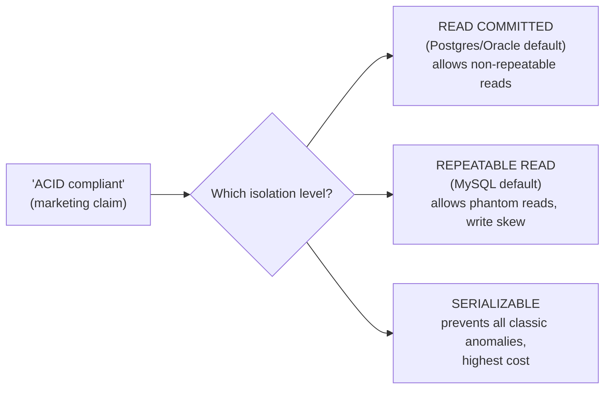
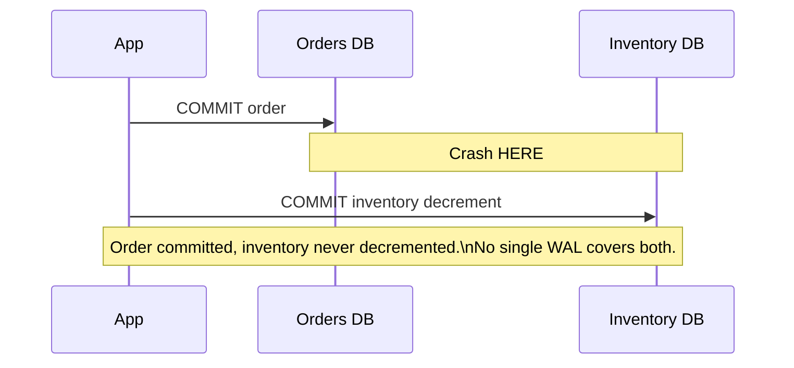

# Transactions & ACID — Senior

<!-- level-focus -->
At senior level, focus on this question:

> Where does "ACID" quietly stop meaning what people assume it means?

Prerequisite: [`middle.md`](middle.md).

---

## "Isolation" is not one guarantee — it's a dial

The single word "Isolation" in ACID hides an entire spectrum of isolation
levels (Read Uncommitted → Serializable), each preventing a different subset
of anomalies (dirty reads, non-repeatable reads, phantom reads, write skew).
**A database advertising "ACID" tells you nothing about which anomalies your
specific transaction is protected from** unless you also know its isolation
level — most production databases default to something weaker than
`SERIALIZABLE` (Postgres defaults to `READ COMMITTED`). See
[Isolation Levels](../isolation-levels/README.md) for the full anomaly
table.

> 🎯 **Senior takeaway:** never accept "the database is ACID" as an answer to
> "can transaction A see transaction B's in-progress work?" Ask for the
> isolation level, then check the anomaly table for that level specifically.

## Consistency is your constraint, not the database's guess

The "C" in ACID is often over-read. The database only enforces the
constraints **you declared** (`CHECK`, `FOREIGN KEY`, `UNIQUE`). It has no
opinion on business rules you didn't encode — "a customer cannot have more
than 3 active subscriptions" is not automatically enforced unless you wrote a
constraint or trigger for it. Consistency is a promise about *your* declared
invariants, not a promise of general application correctness.

## Distributed transactions: ACID doesn't cross a network boundary for free

A single-node database gives you ACID essentially for free via the WAL and a
lock/MVCC manager. The moment a transaction spans **two databases** (or a
database and a message queue), none of that machinery covers the gap between
them automatically:

Achieving atomicity across two databases requires an explicit protocol —
two-phase commit (rigid, blocking, rarely used at scale — see
[2PC/3PC Coordinator](../../distributed-system/distributed-transaction/2pc-3pc-coordinator/README.md))
or a **saga** (a sequence of local transactions with compensating actions —
see [Saga: Orchestration vs Choreography](../../distributed-system/distributed-transaction/saga-orchestration-vs-choreography/README.md)).
This is the senior-level realization: **ACID describes what one database
gives you for free; it says nothing about what happens the moment your
transaction crosses a network boundary.**

## Test yourself

1. A vendor claims their database is "fully ACID." What single follow-up
   question exposes the most operationally important gap in that claim?
2. Give a business rule that a `CHECK` constraint cannot express, and propose
   how you'd enforce it instead.
3. Why can't you simply "add a bigger transaction" to make the orders+inventory
   example above atomic, the way you would with two tables in the same
   database?

Continue to [`professional.md`](professional.md) to see why CDC pipelines are
fundamentally built on top of these guarantees.
