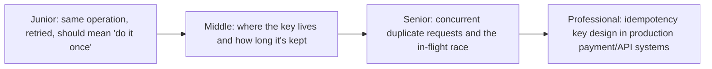
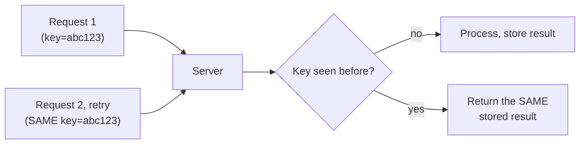

# Idempotency Keys

> A unique identifier attached to a logical operation so that retrying it —
> deliberately or by accident, once or a thousand times — produces exactly
> one effect. The single most load-bearing pattern for making distributed
> systems safe under at-least-once delivery.

## Choose a level

| Level | Guide | You are done when |
|---|---|---|
| Junior | [One key, one effect](junior.md) | You can explain why retrying an operation without an idempotency key risks duplicating its effect. |
| Middle | [Key storage and TTL](middle.md) | You can design where an idempotency key is stored and how long it should be retained. |
| Senior | [The concurrent-request race](senior.md) | You can explain what happens if two requests with the same key arrive at the exact same instant, before either has finished. |
| Professional | [Production idempotency key design](professional.md) | You can design an idempotency key system for a payment API handling millions of requests. |

## Practice rule

For any API endpoint that has a side effect (charges money, sends a
notification, creates a resource), ask: "if this exact request is retried
by the client, a proxy, or a broken network, is it accepted as an
idempotency-key duplicate, or does it silently do the work again?" If you
don't know the answer, the endpoint isn't safe to retry.

## Related

- [Retries & Idempotency](../../../schedule-jobs/04-retries-and-idempotency/README.md)
- [Exactly-Once Semantics](../03-exactly-once-semantics/README.md)
- [Optimistic vs Pessimistic Locking](../04-optimistic-vs-pessimistic-locking/README.md)
