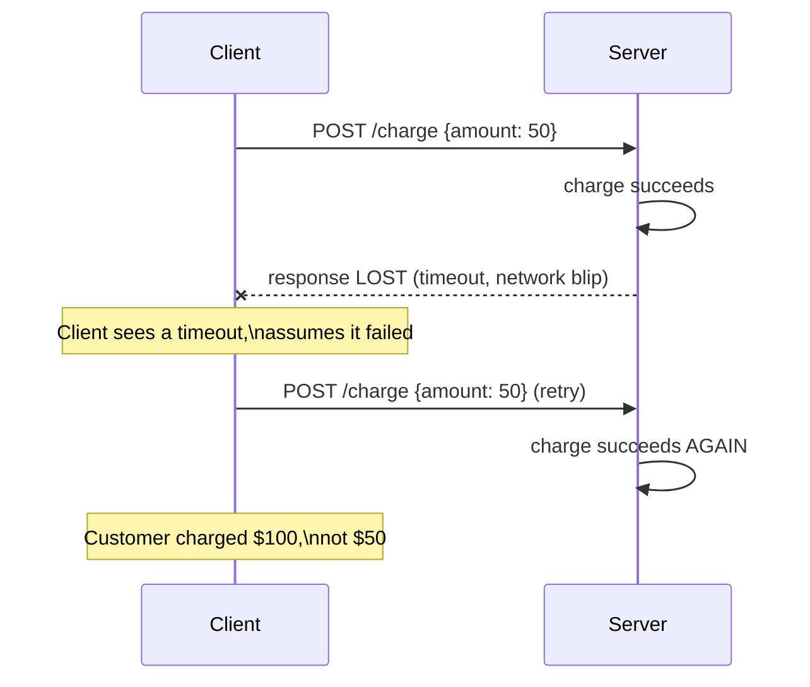
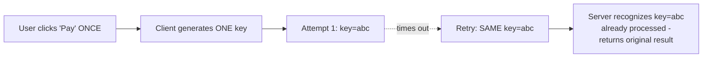

# Idempotency Keys — Junior

<!-- level-focus -->
At junior level, focus on this question:

> Why does retrying an API call without an idempotency key risk duplicating
> its effect, even when retrying "should" be safe?

---

## The retry-duplication problem



From the client's point of view, a timeout is genuinely ambiguous: did the
request never reach the server, or did it succeed and only the *response*
get lost? A naive retry treats both cases the same way — "try again" —
which is safe in the first case and dangerous in the second.

## The fix: a key that means "this is the same logical request"

```http
POST /charge
Idempotency-Key: 7c9e6679-7425-40de-944b-e07fc1f90ae7
{"amount": 50}
```

The client generates this key **once**, when the user initiates the
action (e.g. clicks "Pay"), and sends the **same** key on every retry of
that same logical request. The server, on receiving a request, checks: "have
I already processed this exact key?" If yes, it returns the **original**
result without charging again; if no, it processes normally and remembers
the key.



> 🎓 **Takeaway:** an idempotency key turns "did this specific action
> happen yet?" from an ambiguous question the client can't reliably answer
> into a question the server can answer definitively, because the server
> — not the unreliable network — is the source of truth for "have I seen
> this key."

## Test yourself

1. Why is a timeout specifically ambiguous in a way that an explicit error
   response (like a 400 or 500) usually isn't?
2. Why must the client generate the key **once** per logical action, not
   once per HTTP request attempt?
3. What would go wrong if the client instead used a fresh random key on
   every retry attempt?

Continue to [`middle.md`](middle.md).
