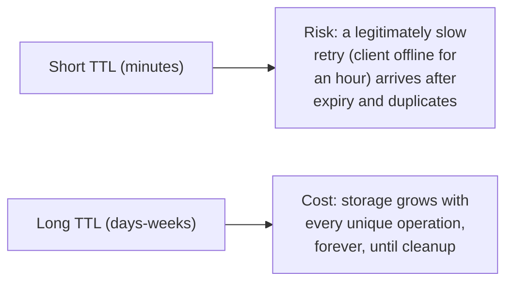

# Idempotency Keys — Middle

<!-- level-focus -->
At middle level, focus on this question:

> Where should an idempotency key and its result actually be stored, and how
> long should the record be kept?

Prerequisite: [`junior.md`](junior.md).

---

## Storing the key alongside the result, atomically

```sql
CREATE TABLE idempotency_keys (
    key TEXT PRIMARY KEY,
    request_hash TEXT NOT NULL,  -- hash of the request body, for validation
    response_status INT,
    response_body JSONB,
    created_at TIMESTAMP DEFAULT now()
);
```

```python
def handle_charge(idempotency_key, request_body, amount):
    existing = db.query(
        "SELECT * FROM idempotency_keys WHERE key = %s", idempotency_key
    )
    if existing:
        if existing.request_hash != hash(request_body):
            raise ConflictError("Same key, different request body")
        return existing.response_status, existing.response_body

    result = process_charge(amount)
    db.execute(
        "INSERT INTO idempotency_keys (key, request_hash, response_status, response_body) "
        "VALUES (%s, %s, %s, %s)",
        idempotency_key, hash(request_body), 200, result
    )
    return 200, result
```

The **request hash check** matters: if a client sends the same key with a
**different** request body (a bug, or a malicious reuse), the server should
reject it as a conflict rather than either silently returning the wrong
cached result or silently processing a different operation under a key
that's supposed to mean "this exact request."

## Choosing a retention window



Most production payment APIs (Stripe's documented approach, for example)
retain idempotency keys for **24 hours** — long enough to cover realistic
retry scenarios (a client crashing and resuming, a mobile app going
offline and reconnecting) without unbounded storage growth. The retention
window is a direct trade-off between "how late can a legitimate retry
arrive and still be safely deduplicated" and "how much storage do we pay
for every processed operation."

> 🎓 **Takeaway:** the idempotency record needs both the **result** (to
> return on a duplicate) and enough of the **original request** (at least a
> hash) to detect a genuine key-reuse conflict — and its retention window is
> a deliberate trade-off, not an afterthought default.

## Test yourself

1. Why is checking a hash of the request body important, beyond just
   checking whether the key exists?
2. If a client's idempotency key retry arrives 25 hours after the original
   request, and the server retains keys for 24 hours, what happens? Is this
   an acceptable risk?
3. What storage cost consideration would push a system toward a shorter
   retention window despite the risk of legitimate late retries?

Continue to [`senior.md`](senior.md).
