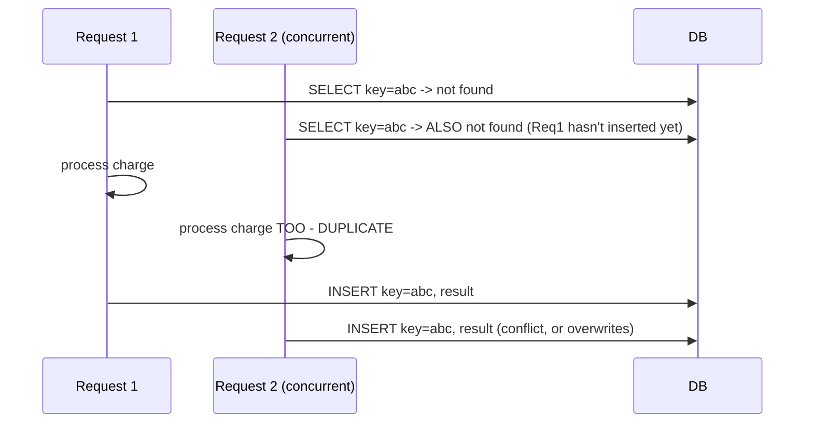
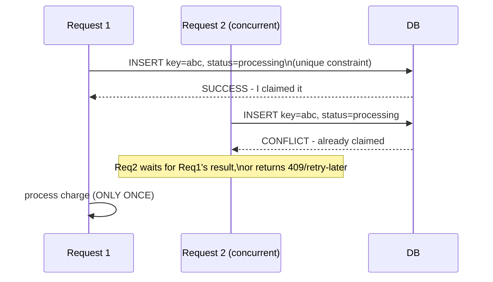

# Idempotency Keys — Senior

<!-- level-focus -->
At senior level, focus on this question:

> What happens if two requests carrying the same idempotency key arrive at
> nearly the same instant, before either has finished processing?

Prerequisite: [`middle.md`](middle.md).

---

## The in-flight race

`middle.md`'s "check if key exists, then process, then insert" has a gap:
if two requests with the same key arrive concurrently, **both** can pass
the "does not exist yet" check before either finishes inserting its result
— leading to both processing the operation, defeating the entire purpose.



This is exactly the same class of race as the schedule-driven job
duplicate-trigger problem and the cache-invalidation race covered
elsewhere in this tree — **check-then-act without atomicity is never
safe under concurrency.**

## The fix: claim the key atomically, before processing

```sql
-- Atomic claim: insert a "processing" placeholder FIRST, with a unique
-- constraint on the key. Only one concurrent request can succeed.
INSERT INTO idempotency_keys (key, status) VALUES (%s, 'processing')
ON CONFLICT (key) DO NOTHING
RETURNING key;
```

```python
def handle_charge(idempotency_key, amount):
    claimed = db.execute(
        "INSERT INTO idempotency_keys (key, status) VALUES (%s, 'processing') "
        "ON CONFLICT (key) DO NOTHING RETURNING key",
        idempotency_key
    )
    if not claimed:
        # Someone else claimed it first - wait for their result, or
        # return a "still processing" response for the client to retry
        return wait_for_result_or_409(idempotency_key)

    result = process_charge(amount)
    db.execute(
        "UPDATE idempotency_keys SET status='done', response=%s WHERE key=%s",
        result, idempotency_key
    )
    return result
```



> 🎯 **Senior takeaway:** the unique constraint on the key, checked via an
> atomic `INSERT ... ON CONFLICT`, is what closes the race — not the
> presence of a key check in application code, which by itself is
> vulnerable to exactly the interleaving shown above. This is the identical
> underlying database mechanism (a unique constraint enforced atomically)
> used for the schedule-driven "exactly one trigger" problem — the same
> primitive, applied to a different concurrency-coordination problem.

## Test yourself

1. Why does the naive "SELECT then INSERT" pattern fail under concurrent
   requests, even though it looks correct for a single request?
2. Walk through why `INSERT ... ON CONFLICT DO NOTHING` closes this race
   specifically — what does the database guarantee about concurrent inserts
   with the same unique key?
3. What should the "losing" concurrent request do while waiting for the
   "winning" request to finish processing — return an error immediately, or
   wait and poll?

Continue to [`professional.md`](professional.md) to design a production
idempotency key system for a high-volume payment API.
