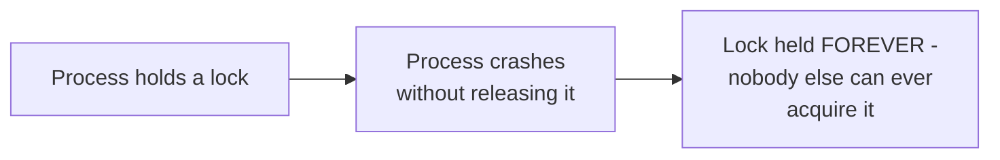
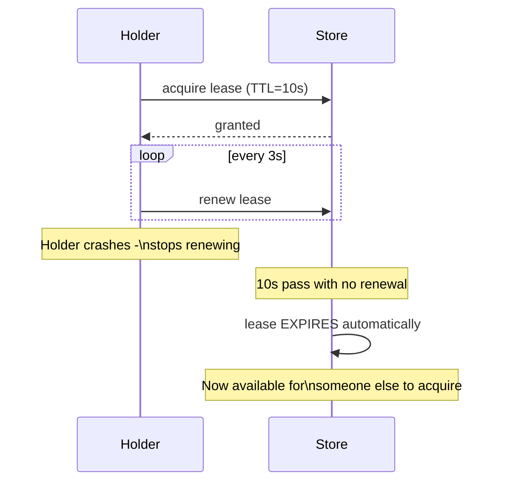

# Leases & Fencing — Junior

<!-- level-focus -->
At junior level, focus on this question:

> Why is a self-expiring lease safer than a plain lock with no expiry at
> all?

---

## A plain lock can be held forever if the holder never releases it

A traditional lock (e.g. a database row lock, or a simple "is this key
present" check) relies on the holder explicitly releasing it. If the
holder crashes before releasing, the lock is stuck forever — no automatic
recovery, requiring manual intervention or a separate crash-detection
mechanism.

## A lease expires automatically

A **lease** is a lock with a built-in expiry (TTL) that the holder must
periodically **renew** to keep. If the holder crashes (or is network-
partitioned, or otherwise stops renewing), the lease automatically expires
after its TTL — no manual intervention needed for the system to recover and
let someone else acquire it.

> 🎓 **Takeaway:** a lease trades "the lock is held until explicitly
> released" (which can mean forever, if the holder crashes) for "the lock
> is held until the TTL expires, unless actively renewed" — self-healing
> from a crashed holder, automatically, at the cost of needing to choose a
> TTL (too short: false expirations under normal jitter; too long: slow
> recovery from a real crash — the same trade-off covered in Leader
> Election).

## Test yourself

1. Why does a plain lock (no TTL) require a separate, manual mechanism to
   recover from a crashed holder, while a lease doesn't?
2. What would happen to a lease-based system if the TTL were set to 24
   hours, and the holder crashed 5 minutes into holding it?
3. Why must the holder actively "renew" a lease periodically, rather than
   just acquiring it once with a long TTL and never renewing?

Continue to [`middle.md`](middle.md).
