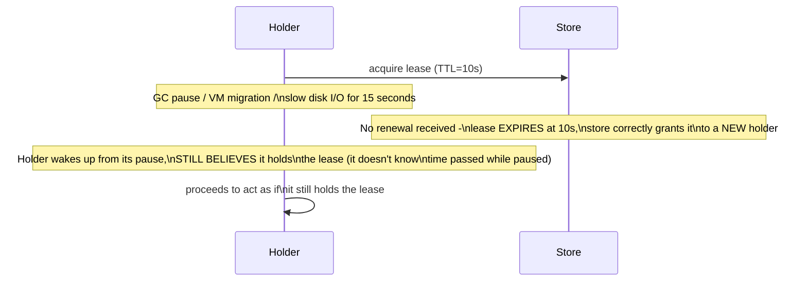

# Leases & Fencing — Middle

<!-- level-focus -->
At middle level, focus on this question:

> Why can a lease expire "correctly" from the lock store's point of view,
> while the holder still believes it holds the lease and keeps acting?

Prerequisite: [`junior.md`](junior.md).

---

## The gap between "the lease expired" and "the holder knows it expired"



The store's expiry logic is completely correct — it did exactly what it
should. The problem is entirely on the **holder's side**: a paused process
has no way to know how much wall-clock time passed while it was frozen, so
it resumes execution with a now-stale belief about its own lease status.
This is not a rare or exotic scenario — GC pauses, VM live-migration
pauses, and OS scheduler starvation are all ordinary events in production
systems, especially under load.

## This means "check if my lease is still valid before acting" isn't enough

```python
# INSUFFICIENT: this check itself can be stale by the time the action runs
if lease.is_still_valid():
    perform_the_protected_action()  # time can pass between the check and this line!
```

Even an explicit check immediately before acting has a race window — the
check could pass, and then a pause (or just an unlucky scheduling delay)
happens **between the check and the actual action**, during which the
lease could expire. Any gap between "confirm I have the lease" and "act as
if I have the lease" is a window where staleness can sneak in.

> 🎓 **Takeaway:** you cannot fix this problem from the holder's side alone
> — no amount of "check more carefully before acting" closes the gap,
> because the fundamental issue is that **time can always pass between a
> check and an action**, and a paused process cannot detect its own pause.
> The fix has to live on the **resource being protected**, not the
> holder — this is exactly `senior.md`'s subject.

## Test yourself

1. Why can't a holder detect its own GC pause or VM migration pause from
   the inside, in order to protect itself?
2. Walk through why checking "is my lease still valid" immediately before
   acting still leaves a race window, however small.
3. Why must the fix for this problem live at the resource being protected,
   rather than in the lease-holder's own logic, no matter how carefully
   that logic is written?

Continue to [`senior.md`](senior.md).
