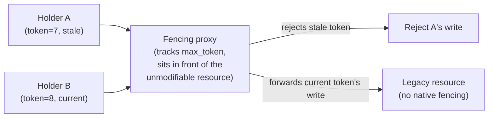
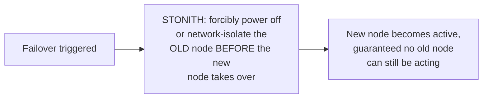

# Leases & Fencing — Professional

<!-- level-focus -->
At professional level, focus on this question:

> How do you implement fencing against a resource that has no native
> version-check capability at all — a legacy API, a physical device, a
> third-party service you don't control?

Prerequisite: [`senior.md`](senior.md).

---

## The hard case: resources without a built-in "reject stale writes" mechanism

`senior.md`'s fencing check assumes the protected resource can store a
"max token seen" and compare against it — trivial for a database row
(a `WHERE token > current_token` clause) but not available for many real
resources: a legacy REST API with no versioning support, a physical actuator
(a robotic arm, a network switch's control plane), or a third-party SaaS
API you have no ability to modify.

## Pattern 1: an intermediary fencing proxy



Introduce a small, purpose-built **proxy service** that owns fencing-token
tracking, sits between every holder and the actual resource, and only
forwards writes from the current highest-seen token — this converts *any*
resource into a fenceable one, at the cost of adding an extra hop and a new
small service that must itself be highly available (a single point of
failure risk to manage, e.g. by making the proxy itself simple, stateless
enough to run multiple replicas of, backed by the same strongly-consistent
store — etcd/ZooKeeper — that issues the tokens in the first place).

## Pattern 2: fencing at the physical/network layer

For physical devices (the canonical example from Kleppmann's writing: a
robotic arm that must be controlled by only one active controller), one
production approach is **network-level fencing**: the previously-active
controller's network access to the device is physically or logically
revoked (a managed switch port disabled, a firewall rule inserted) as part
of the failover process itself, **before** the new controller starts
issuing commands — rather than relying on the device understanding tokens
at all. This is a real technique used in some industrial control systems
and storage area network (SAN) fencing (STONITH — "Shoot The Other Node In
The Head," a real, seriously-used term in high-availability clustering
literature) where the safest fence is disconnecting the potentially-stale
holder from the network entirely.



## Pattern 3: idempotent + last-write-wins acceptance, when true fencing is infeasible

When neither a proxy nor network-level isolation is possible (e.g. a
third-party SaaS API with a rate-limited, unmodifiable interface), the
pragmatic fallback is to **design the operation itself to be safe under
duplicate/stale application** — the same idempotency-key discipline from
the Idempotency Keys page, combined with accepting that a stale write might
occasionally apply, but ensuring its effect is harmless or is itself
naturally superseded by the current holder's subsequent, correct writes
(a last-write-wins acceptance, explicitly chosen and documented as a known,
bounded risk, rather than assumed away).

## Production checklist (staff-level)

1. **Identify, for every leased/fenced resource in your system, whether it
   natively supports a version/token check** — if not, choose one of the
   three patterns above deliberately, rather than assuming fencing "just
   works" because you have a lease.
2. **Treat a fencing proxy as critical, highly-available infrastructure**
   if you build one — it becomes a new single point of failure for every
   resource it fences, and must be engineered with the same rigor as the
   coordination service (etcd/ZooKeeper) issuing the underlying tokens.
3. **For physical/hardware resources, evaluate network-level/STONITH-style
   fencing explicitly** rather than assuming a software-only token check is
   sufficient — some resources genuinely cannot be protected any other way.
4. **When true fencing is infeasible (third-party APIs), document the
   accepted risk explicitly** (last-write-wins, or "a stale write might
   occasionally apply but is harmless because...") rather than silently
   hoping the race never manifests.
5. **In an architecture review for any new leader/leader-election-backed
   system controlling an external resource, require an explicit answer for
   "which fencing pattern applies here"** — this is a common, dangerous
   gap where teams correctly implement leader election but never actually
   close the fencing loop at the resource itself.

## Cheat Sheet

```text
+------------------------------------------------------------------+
|               LEASES & FENCING — INTERNALS & SCALE                  |
+------------------------------------------------------------------+
| Resources WITHOUT native version-check support need an explicit       |
| fencing strategy - a lease alone never protects them:                  |
|                                                                        |
| Pattern 1: FENCING PROXY - a small service owns max_token tracking,    |
|   sits in front of the resource, only forwards current-token writes    |
| Pattern 2: NETWORK-LEVEL FENCING (STONITH) - forcibly isolate the      |
|   old holder from the network/device BEFORE the new holder acts -      |
|   used for physical devices with no software fencing capability        |
| Pattern 3: idempotent + accepted last-write-wins risk, DOCUMENTED       |
|   explicitly, when neither proxy nor network fencing is feasible        |
+------------------------------------------------------------------+
| A fencing proxy or STONITH mechanism becomes critical, highly-         |
| available infrastructure in its own right - engineer it with the       |
| same rigor as the coordination service issuing the tokens               |
+------------------------------------------------------------------+
```

## Test yourself

1. Design a fencing proxy architecture for a legacy third-party inventory
   API with no versioning support, and identify its own single-point-of-
   failure risk.
2. Why is STONITH ("Shoot The Other Node In The Head") sometimes the only
   viable fencing mechanism for a physical device, and what does it cost
   operationally compared to a software token check?
3. A team controls a resource where true fencing is genuinely infeasible.
   What would you require them to document before accepting the design in
   review?

## Further Reading

- Martin Kleppmann — "How to do distributed locking" (the original fencing-
  token argument, including the robotic-arm/physical-device example).
- Linux-HA / Pacemaker documentation — "STONITH" (real production
  network-level fencing in HA clustering).
- See also: [Leader Election — professional](../../consensus/leader-election/professional.md),
  [Idempotency Keys — professional](../01-idempotency-keys/professional.md).
