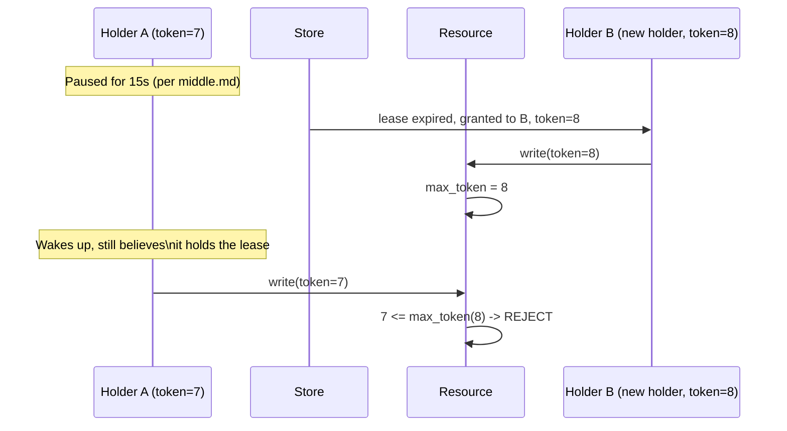

# Leases & Fencing — Senior

<!-- level-focus -->
At senior level, focus on this question:

> How does a fencing token close the gap `middle.md` identified, and why
> must the check happen at the resource, not the holder?

Prerequisite: [`middle.md`](middle.md).

---

## A fencing token: a number that only ever increases

Every time a lease is granted (or renewed to a new holder after expiry),
the lease store issues a **fencing token** — a strictly increasing number
(often just the lease store's own revision counter, if it's backed by
etcd/ZooKeeper). The holder must include this token with **every** action
it takes against the protected resource.



## Why the check must happen at the resource

The resource being protected — not the lock store, and not the holder —
tracks the **highest token it has ever accepted** and rejects any write
carrying an equal-or-lower token. This is precisely why the fix can't live
in the holder's logic (`middle.md`'s conclusion): the holder's belief about
its own lease status can be wrong, but **the resource's record of "the
highest token I've ever seen" cannot be fooled by a paused process's stale
belief** — it's a simple, monotonic comparison that doesn't depend on
knowing anything about time or pauses at all.

```python
def write_to_resource(token, data):
    current_max = get_max_token_seen()
    if token <= current_max:
        raise StaleTokenError(f"Token {token} <= current max {current_max}")
    apply_write(data)
    set_max_token_seen(token)
```

> 🎯 **Senior takeaway:** a lease answers "who is currently supposed to be
> in charge" — a question that can become stale the instant it's answered.
> A fencing token answers "is this specific action definitely not from
> someone who's already been superseded" — a question the resource can
> answer correctly forever, using nothing more than a monotonic
> comparison, regardless of any clock, pause, or belief the holder might
> have. This is why fencing, not a shorter lease TTL, is the actual fix for
> the problem `middle.md` identified.

## Test yourself

1. Why can the resource's "highest token seen" check never be fooled by a
   paused holder's stale belief, when the holder's own lease-validity check
   (`middle.md`) can be?
2. What would happen if two different holders were somehow issued the
   *same* token — walk through why the lease store issuing strictly
   increasing tokens is essential.
3. Design the fencing check for a resource that's a simple text file on a
   shared filesystem (no database, no built-in version column) — how would
   you implement "reject writes from a stale token" here?

Continue to [`professional.md`](professional.md) to apply fencing to
resources that don't natively support version checks.
