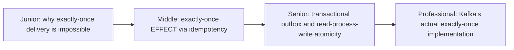

# Exactly-Once Semantics

> "Exactly-once" is one of the most misused phrases in distributed systems.
> True exactly-once delivery across a network is provably impossible in
> general — what real systems actually deliver is at-least-once delivery
> plus exactly-once *effect*, achieved through idempotency and transactional
> tricks.



```mermaid
flowchart LR
    Delivery["Exactly-once DELIVERY\n(impossible in general)"] -.-.- Effect["Exactly-once EFFECT\n(achievable via idempotency\n+ deduplication)"]
```

## Choose a level

| Level | Guide | You are done when |
|---|---|---|
| Junior | [Why exactly-once delivery is impossible](junior.md) | You can explain the fundamental network-uncertainty problem that rules out true exactly-once delivery. |
| Middle | [Exactly-once effect via idempotency](middle.md) | You can explain the distinction between delivery and effect, and why the latter is what actually matters. |
| Senior | [Transactional outbox](senior.md) | You can design a read-process-write pipeline that achieves exactly-once effect end to end. |
| Professional | [Kafka's real implementation](professional.md) | You can explain how Kafka's idempotent producer and transactions actually implement "exactly-once" internally. |

## Practice rule

Whenever someone claims a system provides "exactly-once processing," ask:
"exactly-once delivery, or exactly-once effect?" If they can't answer the
distinction, they likely mean effect (achieved via idempotency) — true
delivery-level exactly-once doesn't exist over an unreliable network,
full stop.

## Related

- [Retries & Idempotency](../../../schedule-jobs/04-retries-and-idempotency/README.md)
- [Idempotency Keys](../01-idempotency-keys/README.md)
- [Idempotent Inbox-Outbox](../../../event-streaming/events-driven/07-idempotent-inbox-outbox/README.md)
