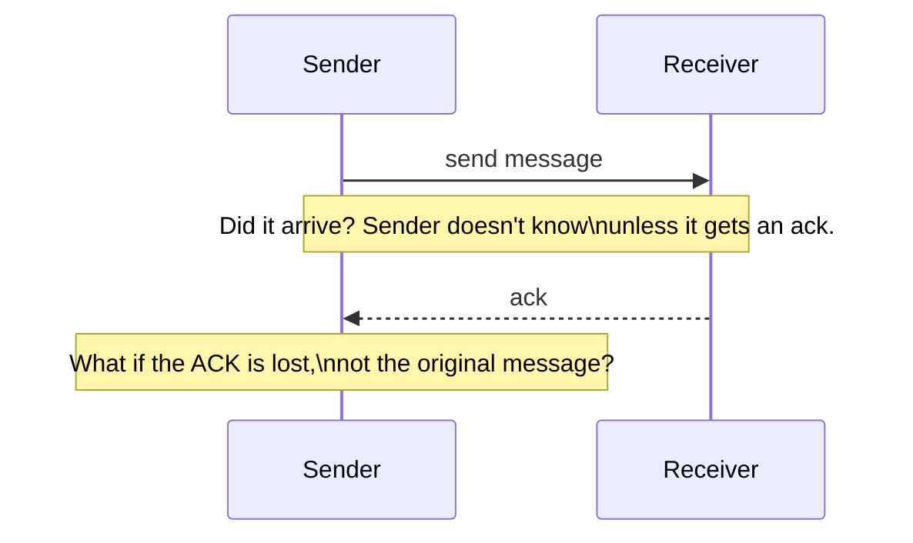
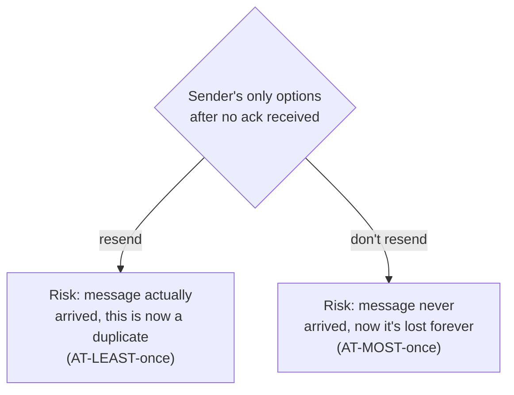

# Exactly-Once Semantics — Junior

<!-- level-focus -->
At junior level, focus on this question:

> Why is it fundamentally impossible for a network to guarantee a message
> is delivered exactly once?

---

## The two-generals-style problem, applied to delivery

The sender's only way to know "did my message arrive" is to receive an
acknowledgment. But the **acknowledgment itself** can be lost, delayed, or
arrive out of order — over an unreliable network, there is no way to
distinguish "the message never arrived" from "the message arrived and was
processed, but the ack was lost" from the sender's side alone.

## Why this rules out true exactly-once delivery

Given genuine ambiguity about whether the original message was received,
the sender has exactly two choices: retry (risking a duplicate if the
original did arrive) or don't retry (risking permanent loss if it didn't).
There is no third option that guarantees "exactly once" — this isn't a
limitation of any particular technology; it's a fundamental property of
communicating over a network where messages and acknowledgments can both
be lost.

> 🎓 **Takeaway:** "at-least-once" (retry on any doubt, risk duplicates) and
> "at-most-once" (never retry, risk loss) are the only two fundamentally
> achievable delivery guarantees. "Exactly-once delivery" is not a stronger
> option available alongside these two — it's provably unachievable over an
> unreliable network. What real systems mean by "exactly-once" is
> `middle.md`'s subject: something different, and achievable.

## Test yourself

1. Why can't the sender simply ask the receiver "did you get my last
   message?" to resolve the ambiguity — what problem does that new question
   have?
2. Which delivery guarantee (at-least-once or at-most-once) would you
   choose for a payment charge, and which for a "heartbeat/keep-alive"
   signal? Why the different choices?
3. Why is this problem fundamentally about the network, not about any
   particular messaging technology's implementation quality?

Continue to [`middle.md`](middle.md).
