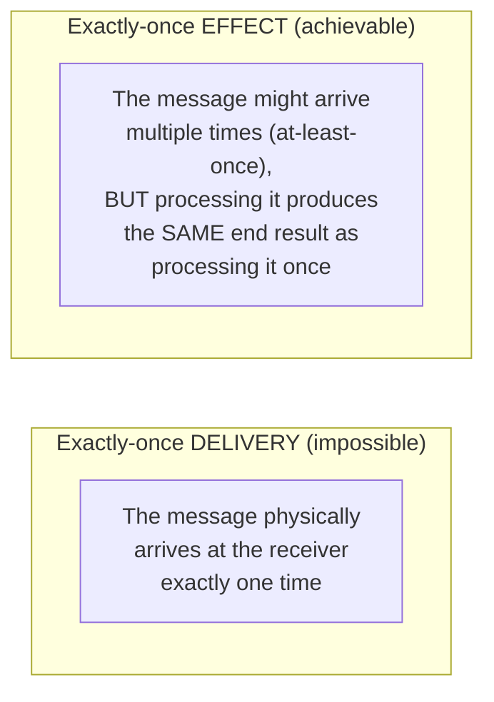

# Exactly-Once Semantics — Middle

<!-- level-focus -->
At middle level, focus on this question:

> If exactly-once delivery is impossible, what do production systems
> actually mean when they claim "exactly-once processing"?

Prerequisite: [`junior.md`](junior.md).

---

## The distinction: delivery vs. effect



What real systems provide — and what "exactly-once semantics" almost
always actually means in production documentation — is **at-least-once
delivery combined with idempotent processing**, which together produce a
system that *behaves* as if each message were processed exactly once, even
though the message might genuinely be delivered and handled multiple times
under the hood.

```python
def process_message(message):
    if already_processed(message.id):  # deduplication check
        return  # safe no-op - this IS the "exactly-once effect"
    apply_effect(message)
    mark_processed(message.id)
```

This is the exact same mechanism as
[Idempotency Keys](../01-idempotency-keys/README.md) and
[Retries & Idempotency](../../17-background-jobs/04-retries-and-idempotency/README.md) —
"exactly-once semantics" is not a different, more advanced technique; it's
the **name given to the outcome** when at-least-once delivery is correctly
paired with idempotent, deduplicated processing.

## Why the distinction matters in practice

Teams that hear "our message queue provides exactly-once delivery" and
skip building idempotent handlers are setting themselves up for a
production incident the first time the underlying at-least-once mechanism
(which is what's really there, dressed up in marketing language) delivers
a duplicate — which it eventually will, because at-least-once systems are
explicitly designed to prefer occasional duplicates over silent loss.

> 🎓 **Takeaway:** "exactly-once" as a marketing term almost always means
> "we've done the idempotency/deduplication work for you, or given you the
> tools to do it correctly" — it is never a claim that duplicates are
> physically impossible at the network/delivery layer. Always ask, or
> verify from documentation, exactly which layer's idempotency guarantee is
> actually being provided.

## Test yourself

1. Why is "exactly-once effect" achievable when "exactly-once delivery" is
   not — what's different about the property being guaranteed?
2. A vendor's messaging product claims "exactly-once delivery" in its
   marketing. What follow-up question would you ask to understand what's
   actually being guaranteed?
3. Why would a team that trusts a marketing claim of "exactly-once" without
   verifying the actual mechanism be at risk of a production incident, even
   if the vendor's claim isn't technically false?

Continue to [`senior.md`](senior.md).
