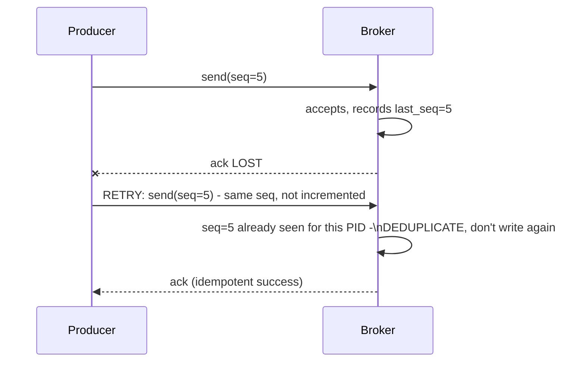
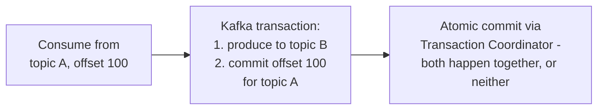

# Exactly-Once Semantics — Professional

<!-- level-focus -->
At professional level, focus on this question:

> How does Kafka's own "exactly-once semantics" (EOS) feature actually work
> internally — the idempotent producer's sequence numbers and the
> transactional coordinator?

Prerequisite: [`senior.md`](senior.md).

---

## The idempotent producer: sequence numbers per partition

Kafka's **idempotent producer** (enabled via `enable.idempotence=true`,
default since Kafka 3.0) solves the specific problem of a **producer**
retrying a send after an ambiguous failure (exactly `junior.md`'s "was the
ack lost or was the message lost" scenario, from the producer's side).
Each producer is assigned a unique **Producer ID (PID)**, and every message
sent carries a monotonically increasing **sequence number**, per partition.
The broker tracks the last sequence number it accepted from each PID/
partition pair, and **rejects (silently deduplicates) any message with a
sequence number it has already seen** — converting the producer's
at-least-once retry behavior into an effectively-exactly-once write at the
broker.



This closes the exact gap `junior.md` described, but **only** for a single
producer writing to a single partition — it does not, by itself, provide
any guarantee across multiple partitions or across a consume-transform-
produce pipeline spanning multiple topics, which is what Kafka's
**transactions** feature (the second half of EOS) exists to cover.

## Kafka transactions: atomic multi-partition writes plus consumer offset commits

Kafka transactions let a producer atomically write to **multiple
partitions/topics** and, critically, atomically commit a **consumer group's
offset** as part of the same transaction — this is the specific mechanism
that solves `senior.md`'s read-process-write problem natively within Kafka,
without needing a separate database-backed outbox table, because Kafka
itself becomes both the "read" source and the "write" destination with a
single atomic commit spanning both.



Internally, this is implemented via a dedicated **Transaction Coordinator**
(itself a Kafka broker role, using a special `__transaction_state` internal
topic as its own durable log — the same WAL-based durability pattern from
the Transactions & ACID professional page, just implemented as a Kafka
topic instead of a traditional database) that writes transaction begin/
commit/abort markers, and consumers configured with
`isolation.level=read_committed` **only see messages from committed
transactions**, filtering out any messages from a transaction that was
aborted (e.g. due to the producer crashing mid-transaction) — this
filtering is what makes an aborted transaction's partial writes invisible
to downstream consumers, rather than requiring the producer to somehow
"undo" already-sent messages.

## Production checklist (staff-level)

1. **Enable `enable.idempotence=true` as a baseline for any producer**
   where duplicate messages from ambiguous ack failures would cause real
   problems — it's low-cost and solves `junior.md`'s specific producer-side
   retry-duplication problem with no application code changes needed.
2. **Use Kafka transactions specifically for consume-transform-produce
   pipelines needing atomic offset-commit-plus-produce**, rather than
   building a custom outbox pattern, when your pipeline lives entirely
   within Kafka — it's the native, well-tested mechanism for exactly this
   shape.
3. **Set `isolation.level=read_committed` on any consumer that must never
   see partial/aborted transactional writes** — this is not the default in
   every client configuration and must be set explicitly.
4. **Understand that idempotent producers and transactions solve different,
   composable problems** (single-partition retry deduplication vs.
   multi-partition/consume-produce atomicity) — enabling one without
   understanding what the other covers can leave a real gap in your actual
   guarantee.
5. **In a design review for a Kafka-based pipeline claiming "exactly-once,"
   require an explicit trace through which specific Kafka mechanism
   (idempotent producer, transactions, both, or neither) is actually
   providing that guarantee** — "we use Kafka so it's exactly-once" is not
   a sufficient design justification.

## Cheat Sheet

```text
+------------------------------------------------------------------+
|        EXACTLY-ONCE SEMANTICS — INTERNALS & SCALE (Kafka)            |
+------------------------------------------------------------------+
| Idempotent producer: Producer ID (PID) + monotonic SEQUENCE NUMBER    |
| per partition. Broker deduplicates by (PID, seq) - closes the         |
| producer-side "ack lost, did the send actually happen?" ambiguity     |
| for a SINGLE producer writing to a SINGLE partition                   |
+------------------------------------------------------------------+
| Kafka Transactions: atomic multi-partition writes + atomic consumer   |
| offset commit, coordinated by a TRANSACTION COORDINATOR (broker role, |
| durable via __transaction_state internal topic). Consumers with       |
| isolation.level=read_committed only see COMMITTED transaction         |
| writes - aborted transactions are filtered out, not "undone"          |
+------------------------------------------------------------------+
| Idempotent producer and transactions solve DIFFERENT, composable       |
| problems - enabling one is not automatically the other's guarantee    |
+------------------------------------------------------------------+
```

## Test yourself

1. Explain precisely how the (PID, sequence number) pair lets a Kafka
   broker deduplicate a retried send, and why this only covers a single
   producer/partition pair.
2. Why does `isolation.level=read_committed` need to filter messages at
   read time, rather than the producer somehow "un-sending" an aborted
   transaction's messages?
3. A team enables `enable.idempotence=true` on their producer and claims
   their whole consume-transform-produce pipeline is now "exactly-once."
   What gap would you point out, based on this page?

## Further Reading

- Confluent/Apache Kafka documentation — "Exactly Once Semantics" and
  "Transactions in Apache Kafka" (the KIP-98 design document).
- Neha Narkhede et al. — "Exactly-once Semantics are Possible: Here's How
  Kafka Does It" (Confluent engineering blog, the original detailed
  explanation of the idempotent producer and transaction coordinator).
- See also: [Idempotent Inbox-Outbox](../../../event-streaming/events/07-idempotent-inbox-outbox/README.md),
  [Transactions & ACID — professional](../../../databases/transaction/07-transactions-and-acid/professional.md).
