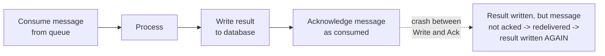
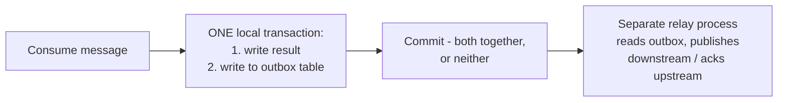

# Exactly-Once Semantics — Senior

<!-- level-focus -->
At senior level, focus on this question:

> How do you achieve exactly-once effect for a full read-process-write
> pipeline, where the "processing" itself involves reading from one system
> and writing to another?

Prerequisite: [`middle.md`](middle.md).

---

## The read-process-write problem

`middle.md`'s idempotency check works cleanly when "processing" is a
single, isolated write. Real pipelines are often **read-process-write**:
consume a message, do some work, write a result **and** acknowledge the
message as consumed — and these are two separate operations against two
separate systems (a message broker and a database, typically), with the
exact same "did both actually happen together" problem covered in the
Transactions & ACID professional page's distributed-transaction discussion.



## The transactional outbox pattern

The production-grade fix: write the result **and** a "ready to be acked/
published" marker in **one local transaction**, against **one database** —
sidestepping the cross-system atomicity problem entirely by making it a
single-system problem.



```sql
BEGIN;
INSERT INTO orders (id, status) VALUES (42, 'processed');
INSERT INTO outbox (event_type, payload) VALUES ('order_processed', '{"order_id": 42}');
COMMIT;  -- both rows committed together, atomically, in ONE database
```

A separate **relay process** (or the same CDC mechanism from the
Transactions & ACID professional page — reading the outbox table's own
WAL) reads the outbox table and publishes the event downstream / acks the
original message — and this relay process is itself made idempotent
(`middle.md`'s technique) so that if *it* crashes and redelivers, the
downstream effect is still exactly-once.

> 🎯 **Senior takeaway:** the transactional outbox pattern doesn't achieve
> cross-system atomicity by inventing a new distributed-transaction
> protocol — it **sidesteps the problem** by making the "did the result and
> the intent-to-acknowledge get committed together" question a
> single-database transactional question (which databases solve for free,
> per the Transactions & ACID professional page), and then separately
> making the downstream relay/publish step idempotent to handle its own,
> now-isolated, at-least-once redelivery risk.

## Test yourself

1. Why does writing the result and the "ready to publish" marker in
   separate transactions (rather than one) reintroduce the exact
   cross-system atomicity problem the outbox pattern is meant to solve?
2. Why must the outbox-relay process itself be idempotent, even though the
   outbox pattern already solved the "write result + mark ready" atomicity
   problem?
3. Design the outbox table schema and relay logic for a pipeline that
   processes incoming orders and must publish an `order_processed` event
   to Kafka exactly-once-in-effect.

Continue to [`professional.md`](professional.md) to see how Kafka's own
"exactly-once semantics" feature is actually implemented internally.
