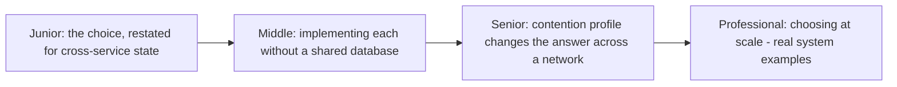

# Optimistic vs. Pessimistic Locking (Distributed Context)

> The same read-and-write concurrency choice covered for a single database
> in the Locking & Concurrency Control topic, now applied across service
> boundaries where there is no shared lock manager at all — and where the
> "lock" itself must be built from scratch using the primitives this whole
> folder covers.



```mermaid
flowchart LR
    Pess["Pessimistic: acquire a\ndistributed lock (etcd/ZK)\nBEFORE acting"] -.-.- Opt["Optimistic: act freely,\nverify a version at\nCOMMIT time (conditional write)"]
```

## Choose a level

| Level | Guide | You are done when |
|---|---|---|
| Junior | [The choice, restated](junior.md) | You can restate the optimistic/pessimistic trade-off in a distributed (not single-database) context. |
| Middle | [Implementing each without a shared DB](middle.md) | You can design a distributed lock and a conditional-write-based optimistic scheme, each using real primitives. |
| Senior | [Why contention changes the answer at scale](senior.md) | You can explain why a choice correct for one contention profile fails badly at another. |
| Professional | [Choosing at scale](professional.md) | You can justify a choice for a real cross-service coordination problem, citing a production system's actual approach. |

## Practice rule

Before choosing between the two for any cross-service coordination problem,
estimate: "how many concurrent writers will typically be contending for the
same resource, and how expensive is a wasted, retried write?" Those two
numbers, not intuition, should drive the choice.

## Related

- [Locking & Concurrency Control](../../../databases/transaction/09-locking-and-concurrency-control/README.md)
- [Leases & Fencing](../02-leases-and-fencing/README.md)
- [Coordination Services](../05-coordination-services/README.md)
