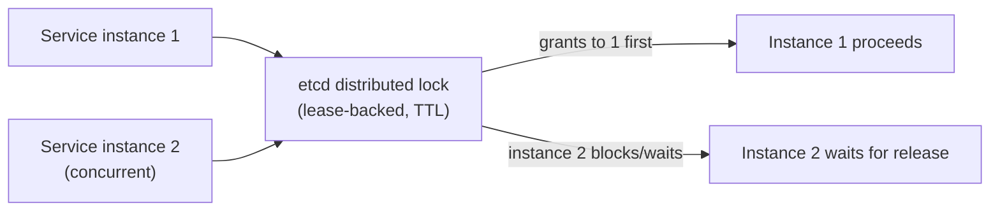
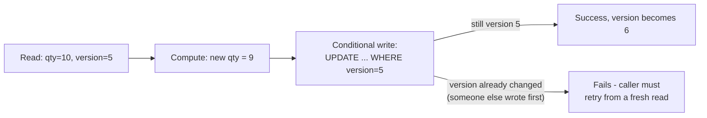

# Optimistic vs. Pessimistic Locking — Middle

<!-- level-focus -->
At middle level, focus on this question:

> What does each approach actually look like, concretely, when built from
> distributed primitives instead of database features?

Prerequisite: [`junior.md`](junior.md).

---

## Pessimistic: a distributed lock via etcd

```python
import etcd3

client = etcd3.client()
lock = client.lock("inventory:sku-42", ttl=10)  # a LEASE-backed lock

if lock.acquire():
    try:
        current = get_inventory("sku-42")
        update_inventory("sku-42", current - 1)
    finally:
        lock.release()
else:
    raise Exception("Could not acquire lock - resource busy")
```



The lock's TTL means this **must** be paired with fencing
(see [Leases & Fencing](../02-leases-and-fencing/README.md)) if the
protected resource can't itself verify the lock is still valid at write
time — otherwise a paused holder can still write after its lock has
technically expired and been granted to someone else.

## Optimistic: a conditional write against a versioned resource

```python
def reserve_inventory(sku, quantity):
    current = get_inventory_with_version(sku)  # {qty: 10, version: 5}
    if current.qty < quantity:
        raise InsufficientStock()

    success = conditional_update(
        sku, new_qty=current.qty - quantity,
        expected_version=current.version  # only succeeds if version still 5
    )
    if not success:
        raise ConcurrentModificationError("Retry")  # someone else updated first
```



No lock is held between the read and the write — any number of services
can read the current state freely; only the actual write is guarded, via a
compare-and-swap-style conditional update (the same mechanism from
[Locking & Concurrency Control — senior](../../../databases/transaction/09-locking-and-concurrency-control/senior.md),
just implemented via whatever the specific data store's conditional-write
API offers — a `WHERE version = X` clause in SQL, DynamoDB's
`ConditionExpression`, etcd's compare-and-swap transactions).

> 🎓 **Takeaway:** pessimistic locking in a distributed setting requires
> an external coordination service and, almost always, fencing to be truly
> safe. Optimistic locking requires the resource itself to support a
> conditional/versioned write — if it doesn't, you're back to needing a
> distributed lock (or a fencing proxy, from the Leases & Fencing
> professional page) regardless of your preference.

## Test yourself

1. Why does the pessimistic example above still need fencing at the
   inventory resource, even though it's using a proper distributed lock
   with a lease?
2. What happens to the optimistic example's caller if `conditional_update`
   fails — what must the calling code do next?
3. If your resource is a third-party API with no conditional-write support
   at all, which approach (optimistic or pessimistic) is actually available
   to you, and why?

Continue to [`senior.md`](senior.md).
