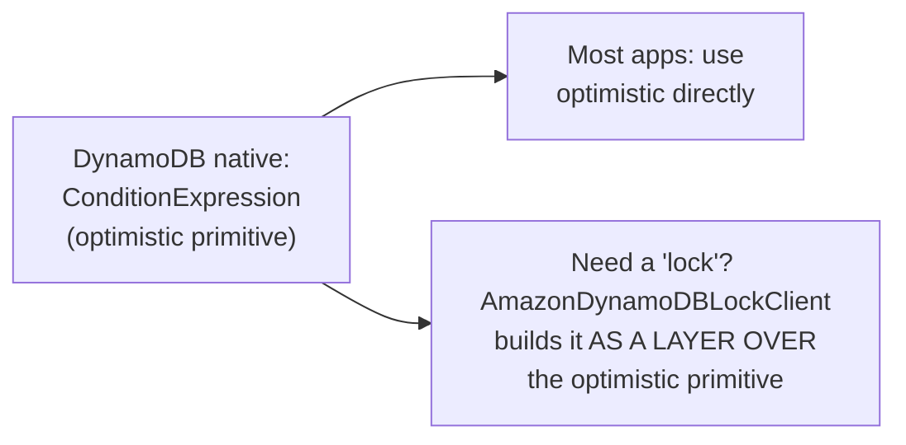
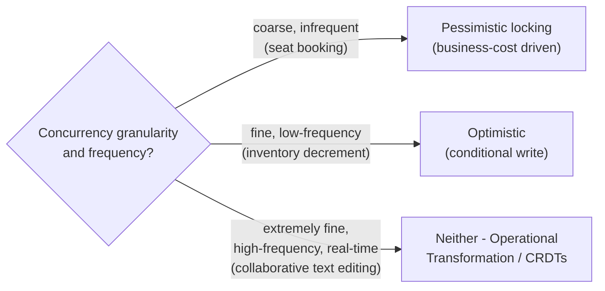

# Optimistic vs. Pessimistic Locking — Professional

<!-- level-focus -->
At professional level, focus on this question:

> How do real, well-documented production systems (DynamoDB, Google Docs'
> collaborative editing, airline seat booking systems) actually choose and
> implement one of these approaches, and why?

Prerequisite: [`senior.md`](senior.md).

---

## DynamoDB: optimistic by default, via conditional expressions

DynamoDB has no native distributed lock primitive at all — its entire
concurrency story is built on **conditional writes**
(`ConditionExpression`), making optimistic concurrency the natural, often
only, default choice for anything built directly on it. AWS's own
documented pattern for "distributed locks on DynamoDB" (the
`AmazonDynamoDBLockClient` library) is itself built **on top of**
conditional writes plus a lease-like TTL attribute — meaning even
DynamoDB's pessimistic-locking story is implemented as a layer over
optimistic primitives, not a native alternative. The professional-level
lesson: **the underlying storage system's native primitives often
determine which approach is the "default" path of least resistance**,
independent of the abstract theoretical trade-off — fighting against your
data store's native primitive to force the "theoretically better" choice
for your contention profile can cost more in implementation complexity than
it saves.



## Airline seat booking: pessimistic locking chosen deliberately, at a real cost

Airline and event-ticketing booking systems historically favor **short-lived
pessimistic locks** (holding a specific seat for a small time window, e.g.
5-10 minutes, while a user completes checkout) specifically because the
business cost of an optimistic-retry failure (telling a user "sorry, that
seat was just taken, please pick another and start checkout again" after
they've already entered payment details) is judged worse than the cost of
briefly locking a seat from other buyers — this is a **product/business
decision about acceptable user experience**, not a purely technical
contention-rate calculation, illustrating that `senior.md`'s cost-based
framework must incorporate business-defined costs, not just technical
retry/lock-hold latency.

## Google Docs / collaborative editing: neither — Operational Transformation / CRDTs

For genuinely concurrent, fine-grained editing (multiple users typing in
the same document simultaneously), **neither** classical optimistic nor
pessimistic locking is used at all — locking any granularity fine enough
to be useful (a single character or word) while still allowing real-time
multi-user editing is impractical with either approach. Instead, systems
like Google Docs use **Operational Transformation** (transforming
concurrent operations against each other so they can be applied in any
order and converge to the same result) — conceptually related to the CRDT
approach from the BASE & Eventual Consistency professional page, but
specifically designed for ordered text-editing operations rather than
general data types. The professional-level lesson: **the
optimistic/pessimistic framing itself doesn't apply to every concurrency
problem** — sufficiently fine-grained, high-frequency concurrent
modification of the same data may require an entirely different technique.



## Production checklist (staff-level)

1. **Check your data store's native concurrency primitive before designing
   against the abstract trade-off** — building against the grain of
   DynamoDB (optimistic-native) or a database with strong native locking
   support changes the real implementation cost on each side.
2. **Incorporate business-defined costs, not just technical latency/retry
   cost, into the choice** — a user-facing "please try again" retry may be
   unacceptable even when it's technically cheap, as the booking-system
   example shows.
3. **Recognize when neither classical option applies** — extremely
   fine-grained, high-frequency, real-time collaborative modification of
   shared data is a different problem class (Operational Transformation,
   CRDTs) that the optimistic/pessimistic framing doesn't cover well.
4. **Re-measure the crossover point for your actual system**, per
   `senior.md` — don't carry over intuition from a single-database context
   or from a different system's published choice without validating it
   against your own contention profile and network latencies.
5. **In an architecture review for a new cross-service coordination
   design, require the reviewer to name which real production system's
   documented approach is closest to the proposed design**, and explain
   why or why not that precedent applies — this surfaces unstated
   assumptions faster than an abstract trade-off discussion alone.

## Cheat Sheet

```text
+------------------------------------------------------------------+
|     OPTIMISTIC vs PESSIMISTIC LOCKING — INTERNALS & SCALE            |
+------------------------------------------------------------------+
| DynamoDB: NO native lock primitive - ConditionExpression IS the       |
| concurrency story. Even "distributed lock" libraries for it           |
| (AmazonDynamoDBLockClient) are built AS A LAYER over conditional        |
| writes. Your store's native primitive shapes the path of least         |
| resistance, independent of abstract theory                             |
+------------------------------------------------------------------+
| Airline booking: PESSIMISTIC chosen deliberately - the BUSINESS        |
| cost of "sorry, retry your checkout" beats the cost of a short-lived   |
| lock. The choice incorporates product/UX cost, not just technical      |
| retry-rate math                                                        |
+------------------------------------------------------------------+
| Google Docs: NEITHER - fine-grained, real-time concurrent editing      |
| uses Operational Transformation / CRDTs instead. The                   |
| optimistic/pessimistic framing doesn't cover every concurrency         |
| problem class                                                          |
+------------------------------------------------------------------+
```

## Test yourself

1. Why does building a "distributed lock" library on top of DynamoDB still
   end up implemented via conditional writes rather than a genuinely
   different, lock-native mechanism?
2. Why is the airline-booking system's choice of pessimistic locking driven
   by a business/UX cost rather than a pure contention-rate calculation —
   what would the "wrong" optimistic-only design feel like to a user?
3. Design a rough decision tree (granularity, frequency, business cost of
   a retry) that a team could use to choose between optimistic,
   pessimistic, and "neither" (OT/CRDT) for a new coordination problem.

## Further Reading

- AWS documentation — "Amazon DynamoDB Lock Client" (the library
  illustrating locks built over conditional writes).
- Ellis & Gibbs — "Concurrency Control in Groupware Systems" (the original
  Operational Transformation paper, foundational to Google Docs-style
  collaborative editing).
- See also: [Leases & Fencing — professional](../02-leases-and-fencing/professional.md),
  [BASE & Eventual Consistency — professional](../../../databases/transaction/11-base-and-eventual-consistency/professional.md).
