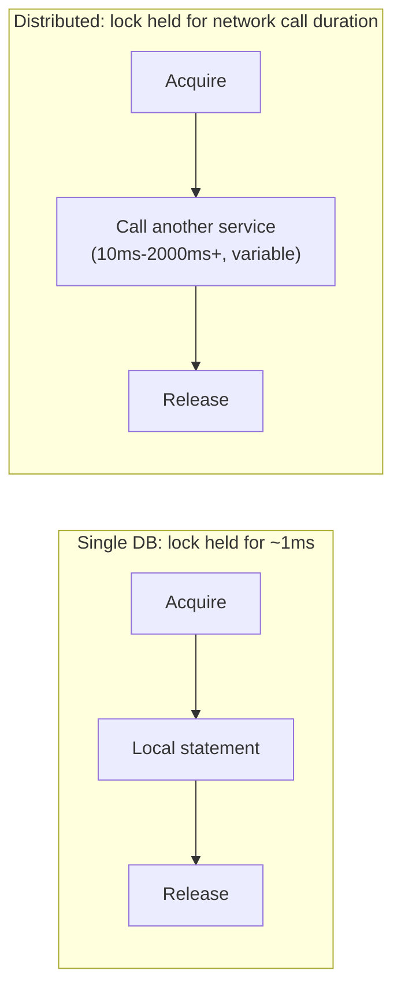

# Optimistic vs. Pessimistic Locking — Senior

<!-- level-focus -->
At senior level, focus on this question:

> Why does network latency specifically change the calculus between
> optimistic and pessimistic locking, in a way that doesn't apply within a
> single database?

Prerequisite: [`middle.md`](middle.md).

---

## Lock hold time now includes network round trips

Within a single database, a pessimistic lock is typically held for
microseconds to milliseconds — the time to execute a local statement. In a
distributed setting, if the "critical section" between acquiring and
releasing a lock involves calling **another service over the network**
(common in cross-service coordination), the lock is held for the **full
duration of that network call**, including its own latency variance and
potential timeouts — dramatically increasing both the average and the
tail lock-hold duration compared to a purely local operation.

This means a contended resource protected by pessimistic locking in a
distributed setting can see **dramatically worse queueing** than the
equivalent single-database scenario would predict — every waiter is now
blocked not on a fast local operation, but on however long the critical
section's network call happens to take, including its tail latency.

## Optimistic locking's retry cost also changes shape

Optimistic locking's cost model (wasted work on a conflicting retry) is
also affected: if the "work" being redone on a conflict includes an
expensive network call (not just recomputing a local value), a high
retry rate under contention means **repeatedly re-executing that expensive
call** — which can itself add load to a downstream dependency, in a
milder echo of the retry-amplification problem from the Retries &
Idempotency professional page.

> 🎯 **Senior takeaway:** the contention-based decision rule from the
> single-database version of this topic still applies (low contention →
> optimistic; high contention → pessimistic), but the **absolute costs on
> both sides of the trade-off are amplified by network latency** in a
> distributed setting — meaning the crossover point (where pessimistic
> becomes worth its lock-hold cost, or optimistic's retry waste becomes
> unacceptable) shifts, and must be re-measured for your actual
> cross-service latencies, not assumed to match single-database intuition.

## Test yourself

1. Why does a pessimistic lock held across a network call to another
   service create worse queueing dynamics than the same lock held for a
   local database operation?
2. If the "work" redone on an optimistic retry includes calling a
   rate-limited third-party API, what real operational risk does a high
   retry rate under contention create?
3. Given these amplified costs, would you generally lean more toward
   optimistic or pessimistic locking for cross-service coordination
   involving expensive network calls in the critical section? Justify it.

Continue to [`professional.md`](professional.md) to see how real systems
choose between these approaches at scale.
