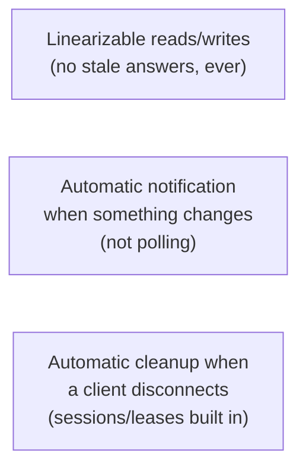
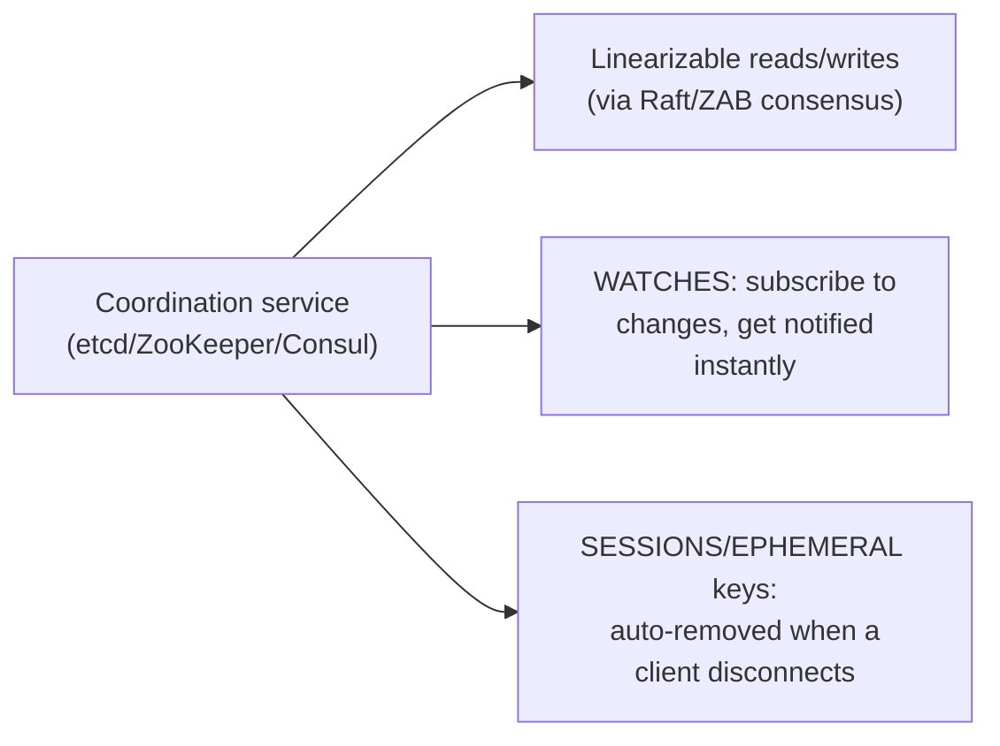

# Coordination Services — Junior

<!-- level-focus -->
At junior level, focus on this question:

> Why isn't an ordinary database (even a strongly consistent one) the right
> tool for leader election, distributed locks, or service discovery?

---

## What these problems actually need

Leader election, distributed locking, and service discovery all share a
specific, demanding set of requirements: **every** reader must see the
absolute latest value (a stale "who's the leader" answer can cause
split-brain, per [Leader Election](../../consensus/leader-election/README.md)),
clients need to be **notified** the instant something changes rather than
polling repeatedly, and a disconnected/crashed client's registrations
should be **automatically cleaned up** rather than lingering forever. A
general-purpose database (even Postgres with `SERIALIZABLE` isolation) can
technically provide the first requirement, but doesn't natively provide the
second or third — you'd have to build change-notification and
session-cleanup machinery yourself, on top of a tool not designed for it.

## Coordination services are purpose-built for exactly this

etcd, ZooKeeper, and Consul are small, deliberately low-throughput,
highly-consistent clusters (backed by Raft or ZAB — a Paxos-family
protocol used by ZooKeeper) whose entire purpose is providing these three
properties as first-class, built-in features — you use them specifically
**because** re-implementing this reliably on top of a general-purpose
database is a substantial, error-prone engineering effort that these
systems have already solved and hardened.

> 🎓 **Takeaway:** a coordination service isn't "just a database" — it's a
> specialized tool trading away general-purpose throughput and flexibility
> for a very specific set of consistency and notification guarantees that
> distributed coordination problems need and general databases don't
> provide out of the box.

## Test yourself

1. Why is "stale read" specifically dangerous for a "who is the current
   leader" query, in a way it might not be for, say, a product catalog
   query?
2. What would you have to build yourself, on top of a plain database, to
   replicate a coordination service's "notify me when this value changes"
   behavior?
3. Why is "automatically clean up when a client disconnects" hard to
   replicate reliably with a plain database row and no additional
   mechanism?

Continue to [`middle.md`](middle.md).
