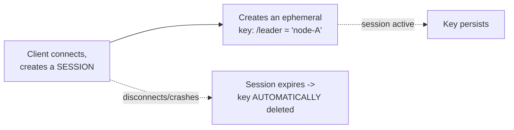
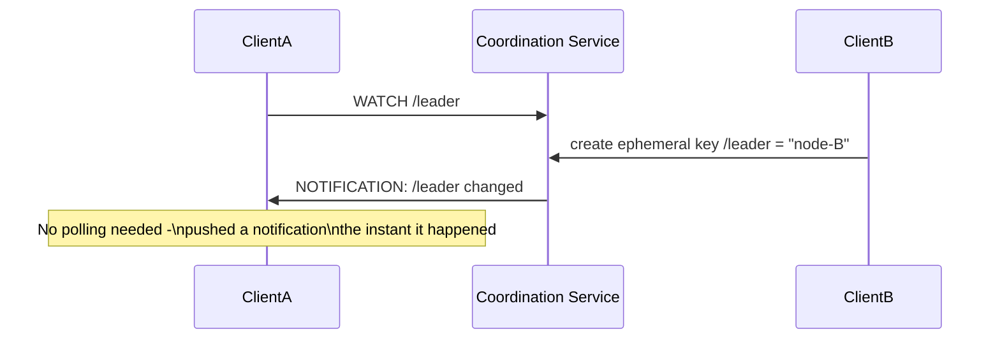

# Coordination Services — Middle

<!-- level-focus -->
At middle level, focus on this question:

> How do watches, sessions, and ephemeral nodes combine to implement
> something like leader election or service discovery?

Prerequisite: [`junior.md`](junior.md).

---

## Ephemeral nodes: keys tied to a client's session



An **ephemeral** key (ZooKeeper's term; etcd achieves the same via a lease
attached to a key) exists only as long as the client's session is active —
if the client disconnects, crashes, or its session times out (no
heartbeat), the coordination service **automatically deletes** the key.
This is precisely the automated-cleanup property from `junior.md` — no
separate "did this client die" detection logic needed in your application.

## Watches: get notified, don't poll



A **watch** registers interest in a key (or key prefix), and the
coordination service pushes a notification the instant that key changes —
turning "keep checking every second" into "get told immediately," which
matters both for latency (near-instant reaction) and for load (no wasted
polling requests, echoing the polling-vs-callback trade-off from the
Returning Results topic).

## Combining them for leader election

```python
import etcd3

client = etcd3.client()
lease = client.lease(ttl=10)  # session-like: must be kept alive

election = client.election("/service/leader")
election.campaign(b"node-A", lease=lease)  # ephemeral - tied to the lease

# Any node, anywhere, can WATCH for leadership changes:
for event in client.watch("/service/leader"):
    print(f"Leader changed: {event}")
```

The lease provides the ephemeral/session behavior (a crashed node's
"claim" to leadership disappears automatically); the watch lets every
other node react instantly to a leadership change, without polling — this
combination is precisely what
[Leader Election — middle](../../consensus/leader-election/middle.md)'s
etcd example relies on under the hood.

> 🎓 **Takeaway:** watches + sessions/ephemeral keys are the two building
> blocks that turn a coordination service's linearizable key-value store
> into a platform for leader election, service discovery ("register my
> address as an ephemeral key, watch the prefix to see all live
> instances"), and distributed locking — all three are the same two
> primitives, applied to different key structures.

## Test yourself

1. Why does tying a key's existence to a session/lease eliminate the need
   for separate "is this client still alive" detection logic?
2. How would you use ephemeral keys plus a watch to implement basic service
   discovery (a list of currently-live service instances)?
3. What would happen if a client's session TTL were set much shorter than
   its actual heartbeat interval — what failure mode would you expect?

Continue to [`senior.md`](senior.md).
