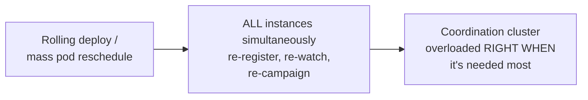

# Coordination Services — Senior

<!-- level-focus -->
At senior level, focus on this question:

> Why does under-provisioning (or overloading) the coordination cluster
> turn it into the single scariest point of failure in your entire
> architecture?

Prerequisite: [`middle.md`](middle.md).

---

## Everything depends on it, and it's deliberately small

A coordination service cluster is typically **small** (3 or 5 nodes,
rarely more, because consensus protocols like Raft/ZAB have diminishing
returns and higher latency as node count grows — see the Raft professional
page) and **deliberately low-throughput** relative to a typical application
database, because every write requires full consensus across the cluster.
But architecturally, **every service doing leader election, distributed
locking, or service discovery depends on it** — meaning it sits at the
center of a much larger system's availability, despite being smaller and
lower-throughput than almost everything depending on it.

```mermaid
flowchart TD
    Coord["Coordination cluster\n(3-5 nodes, small,\nlow-throughput BY DESIGN)"] --> S1[Service A: leader election]
    Coord --> S2[Service B: distributed locks]
    Coord --> S3[Service C: service discovery]
    Coord --> S4[Service D: shared config]
    Overload["Coordination cluster\noverloaded or down"] -.-.-> AllDown["ALL FOUR services'\ncoordination-dependent\nfunctions degrade\nSIMULTANEOUSLY"]
```

## The thundering herd against the coordination service

A common, real production incident: many application instances all
restart simultaneously (a rolling deploy, a mass Kubernetes pod
rescheduling event) and **all** immediately try to re-register their
ephemeral keys, re-establish watches, and re-campaign for leadership at
once — hitting the coordination cluster with a burst of requests far
exceeding its normal steady-state load. Because the coordination service
is deliberately provisioned for a lower, steady load profile (per its
consensus-driven throughput ceiling), this burst can **overload the
coordination cluster itself**, at the exact moment every dependent
service most needs it to be responsive (during a mass restart, when
leader election and service discovery matter most).



## Watch storms: a specific, well-documented overload pattern

A single key change that many clients are watching (e.g. a shared
configuration value read by thousands of services) triggers a **watch
notification fan-out** to every watcher simultaneously — at sufficient
watcher count, this fan-out itself can become a significant load spike on
the coordination cluster, distinct from the write load of the change
itself. ZooKeeper's and etcd's documentation both explicitly discuss watch
scalability limits and recommend patterns (batching, watching prefixes
instead of thousands of individual keys) specifically to mitigate this.

> 🎯 **Senior takeaway:** a coordination service's small size and low
> throughput are deliberate design choices for consistency, not
> under-provisioning mistakes — but this means it must be protected from
> load patterns (mass simultaneous reconnection, watch storms) that would
> be routine for a general-purpose database but can overwhelm a
> consensus-bound cluster. Capacity planning for a coordination service
> must explicitly account for correlated burst scenarios, not just
> steady-state load.

## Test yourself

1. Why does a coordination service's consensus-based design inherently
   limit its write throughput compared to a typical application database,
   and why is this an acceptable trade-off given what it's used for?
2. Walk through why a rolling deploy of 500 application instances can
   create a load spike on the coordination cluster far exceeding normal
   steady-state traffic.
3. Why does a single configuration change watched by thousands of clients
   create load proportional to the watcher count, not just the size of the
   change itself?

Continue to [`professional.md`](professional.md) to see how etcd and
ZooKeeper's internals inform operating them safely at scale.
