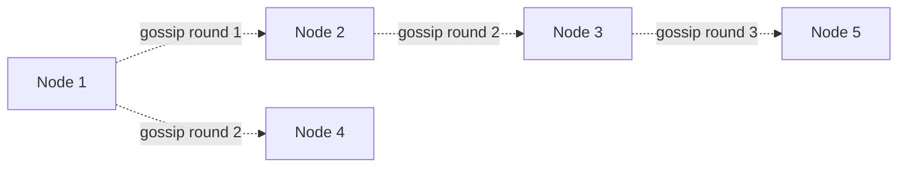

# Gossip Protocol

> Instead of a central authority tracking cluster membership, every node
> periodically exchanges what it knows with a few random peers — and
> cluster-wide knowledge propagates in a handful of rounds, without any
> single node needing to know about everyone directly. The mechanism behind
> Cassandra's and Consul's membership and failure detection.

## Choose a level

| Level | Guide | You are done when |
|---|---|---|
| Junior | [Why centralized membership doesn't scale](junior.md) | You can explain why a central node tracking every cluster member becomes a bottleneck and single point of failure. |
| Middle | [How gossip rounds spread information](middle.md) | You can explain why information reaches the whole cluster in O(log N) rounds, not O(N). |
| Senior | [Phi accrual failure detection](senior.md) | You can explain why a continuous suspicion score beats a fixed timeout for failure detection. |
| Professional | [Gossip internals at scale](professional.md) | You can explain how Cassandra tunes gossip for large clusters and the trade-offs involved. |

## Practice rule

For any system using gossip for membership, ask: "how many rounds would it
take for a state change on one node to reach every node in a cluster of
this size?" If you can compute that (it's a simple logarithm), you
understand gossip's core performance property.

## Related

- [Leader Election](../leader-election/README.md)
- [NoSQL Modeling — professional](../../../databases/data-modeling/03-nosql-modeling/professional.md)
