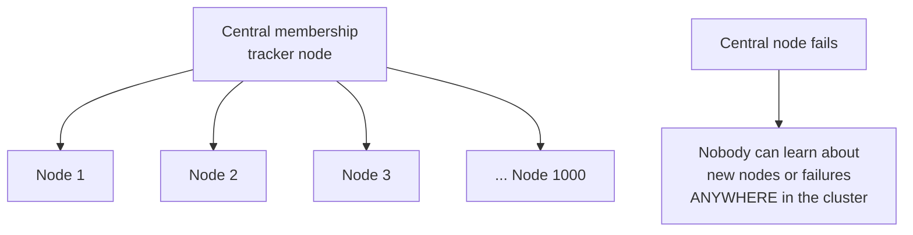
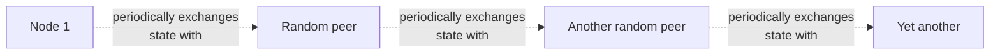

# Gossip Protocol — Junior

<!-- level-focus -->
At junior level, focus on this question:

> Why does having one central node track "who's in the cluster" become a
> bottleneck and a single point of failure as the cluster grows?

---

## The centralized approach and its problems

If one designated node tracks cluster membership, every node must talk to
it to learn about the rest of the cluster — this node becomes both a
**bottleneck** (every membership query and update funnels through it) and
a **single point of failure** (if it goes down, the entire cluster loses
its shared view of who's alive, even if every other node is perfectly
healthy).

## Gossip: no central authority, information spreads peer-to-peer

In a **gossip protocol**, every node periodically picks a small number of
**random** peers and exchanges what it currently knows about cluster state
(who's alive, who's joined, who's suspected dead) — no node is special, no
node is a bottleneck, and there's no single point of failure for the
membership information itself, because every node independently holds (an
eventually-consistent copy of) the same knowledge.

> 🎓 **Takeaway:** gossip trades the simplicity of "ask the one node who
> knows" for resilience and scalability — no single node's failure can
> block the spread of information, and no single node needs to handle
> membership-query traffic from the entire cluster. The cost, covered in
> `middle.md`, is that information takes a small number of rounds to
> propagate everywhere, rather than being instantly globally consistent.

## Test yourself

1. Why does a centralized membership tracker become a worse bottleneck as
   cluster size grows, specifically?
2. What happens to the whole cluster's ability to learn about new members
   if the centralized tracker crashes, even if every other node is
   healthy?
3. Why is it acceptable, in a gossip-based system, that not every node
   knows about a new member instantly?

Continue to [`middle.md`](middle.md).
