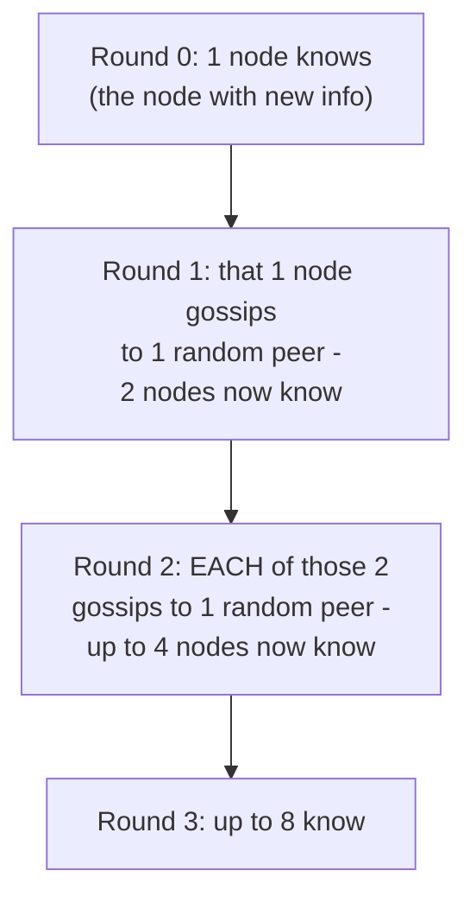

# Gossip Protocol — Middle

<!-- level-focus -->
At middle level, focus on this question:

> Why does information spread to an entire N-node cluster in roughly
> log(N) rounds, rather than needing N rounds?

Prerequisite: [`junior.md`](junior.md).

---

## Exponential spread, round by round



Each round, every node that already knows the information gossips it to
one (or a small fixed number of) new random peer — so the number of
**informed** nodes can roughly **double** each round (assuming random peer
selection mostly hits previously-uninformed nodes, which is statistically
likely early on). Doubling every round means reaching all `N` nodes takes
only about `log2(N)` rounds — for a 1,000-node cluster, that's roughly 10
rounds; for a 1,000,000-node cluster, roughly 20 rounds. This is
dramatically faster than a naive "tell one new node per round" approach,
which would need `N` rounds.

## The exchange itself: comparing version vectors

```python
# Simplified gossip exchange
def gossip_round(my_state, peer):
    peer_state = peer.request_state()
    merged = merge_by_highest_version(my_state, peer_state)
    self.state = merged
    peer.update_state(merged)
```

Each gossip exchange typically compares a **version number per piece of
information** (e.g. "node A's status, version 5" vs. the peer's "node A's
status, version 3") and both sides adopt whichever version is higher —
this ensures gossip naturally converges to the most recent information
without needing a central authority to declare what's "true," using the
same "highest version wins" logic that appears throughout distributed
systems (see the BASE & Eventual Consistency topic's LWW discussion).

> 🎓 **Takeaway:** gossip's logarithmic spread is a direct mathematical
> consequence of **every informed node also becoming a spreader** —
> information doesn't propagate linearly from one source; it propagates
> like a chain reaction, and that's precisely what makes gossip practical
> even for clusters with thousands or millions of nodes.

## Test yourself

1. Roughly how many gossip rounds would you expect to fully propagate a
   change across a 10,000-node cluster?
2. Why does "each informed node also becomes a spreader" produce
   exponential rather than linear propagation?
3. What happens during a gossip exchange if two nodes have conflicting
   information about a third node's status (e.g. one thinks it's alive,
   the other thinks it's suspected dead)? How would version numbers help
   resolve this?

Continue to [`senior.md`](senior.md).
