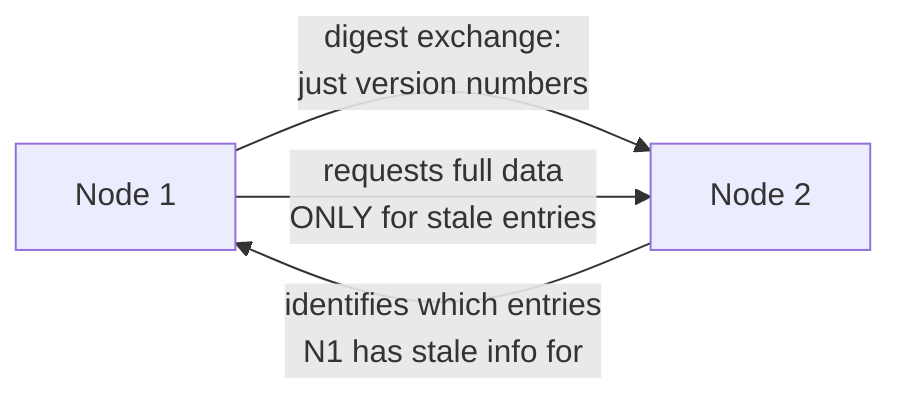
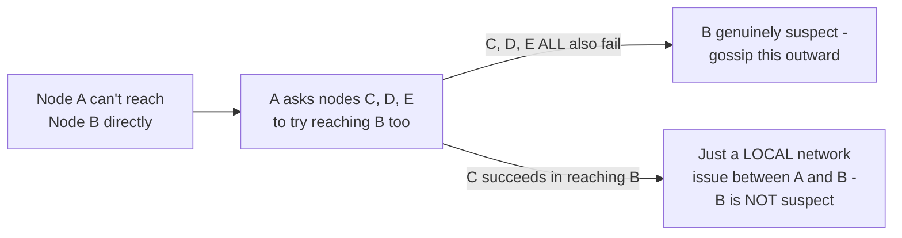

# Gossip Protocol — Professional

<!-- level-focus -->
At professional level, focus on this question:

> How does Cassandra actually implement gossip internally, and what are the
> documented, real operational limits and tuning knobs at large cluster
> sizes?

Prerequisite: [`senior.md`](senior.md).

---

## Cassandra's gossip implementation: heartbeat state plus application state

Cassandra's gossip protocol exchanges two kinds of information per node:
a **heartbeat state** (a version number incremented on a fixed interval,
purely for liveness/Phi Accrual detection, per `senior.md`) and
**application state** (schema version, load, status, token ownership —
data other parts of Cassandra actually need to make decisions). Every
gossip round exchanges a compact **digest** (just version numbers, not full
data) first; only if a peer's digest shows it has staler information for
some node does the actual data get transferred in a follow-up exchange —
this two-phase digest-then-data approach (conceptually similar to the
Merkle-tree "compare hashes first, transfer only divergent data" pattern
from the BASE & Eventual Consistency professional page) minimizes gossip's
own bandwidth overhead, which matters because gossip runs continuously,
forever, as background traffic on every node.



## Documented scaling limits: gossip's own bandwidth grows with cluster size

Cassandra's own documentation and multiple production postmortems
(discussed at Cassandra Summit talks and in DataStax engineering content)
document that gossip traffic itself becomes a **meaningful bandwidth and
CPU cost at cluster sizes in the many-hundreds-to-thousands of nodes
range** — even though gossip's *convergence time* stays logarithmic
(`middle.md`), the **steady-state background traffic** (every node
gossiping to peers continuously, forever) scales with cluster size in a way
that eventually becomes operationally significant, distinct from the
convergence-speed property. This is why very large Cassandra deployments
are frequently split into multiple, smaller logical clusters (or use
Cassandra's own **seed node** and **snitch** configuration carefully) rather
than growing one gossip domain indefinitely — a direct, practical
consequence of gossip's background cost, not just a theoretical limit.

## Consul's gossip: SWIM protocol and its specific improvements

Consul uses the **SWIM protocol** (Scalable Weakly-consistent
Infection-style Membership), which adds a specific refinement over basic
gossip: an **indirect probing** mechanism — if node A can't directly reach
node B to check its health, A asks several **other** nodes to try reaching
B on A's behalf, before declaring B suspect. This directly addresses a
real gossip failure mode: a node that's merely unreachable **from one
specific peer** (a localized network issue between just those two nodes,
not a genuine node failure) would otherwise be falsely suspected by that
one peer and gossip that false suspicion outward — indirect probing
confirms genuine unreachability from multiple vantage points before
spreading a suspicion, directly improving accuracy over naive
direct-probe-only gossip.



## Production checklist (staff-level)

1. **Monitor gossip's own background bandwidth/CPU cost as cluster size
   grows**, not just convergence-time metrics — steady-state gossip
   overhead is a real, separate scaling dimension from the logarithmic
   convergence property covered at the senior level.
2. **Consider splitting very large deployments into multiple logical
   gossip domains** once gossip's own background cost becomes significant,
   rather than growing a single flat gossip cluster indefinitely.
3. **Prefer (or verify your system uses) an indirect-probing mechanism
   like SWIM** for failure detection at scale, rather than naive
   direct-probe-only gossip — it materially improves accuracy against
   localized network issues that aren't genuine node failures.
4. **Tune Phi Accrual thresholds (or your protocol's equivalent) based on
   your actual observed network jitter distribution**, measured from real
   production data, not a default value assumed to be universally correct.
5. **In a capacity-planning review for a growing gossip-based cluster,
   explicitly model steady-state gossip bandwidth/CPU at the target node
   count** — this is a documented, real cost that's easy to overlook when
   focused only on gossip's attractive logarithmic-convergence property.

## Cheat Sheet

```text
+------------------------------------------------------------------+
|              GOSSIP PROTOCOL — INTERNALS & SCALE                    |
+------------------------------------------------------------------+
| Cassandra gossip: heartbeat state (liveness/Phi Accrual) + application  |
| state (schema, load, tokens). Two-phase DIGEST-then-DATA exchange       |
| (compare version numbers first, transfer only stale entries) -         |
| minimizes bandwidth for continuous, forever-running background traffic |
+------------------------------------------------------------------+
| Documented scaling limit: gossip's convergence time stays log(N),      |
| but STEADY-STATE BACKGROUND BANDWIDTH/CPU grows with cluster size -     |
| becomes significant at many-hundreds-to-thousands of nodes -            |
| large deployments split into multiple logical gossip domains           |
+------------------------------------------------------------------+
| Consul's SWIM protocol: INDIRECT PROBING - ask other nodes to verify    |
| unreachability before declaring suspicion, preventing a LOCALIZED       |
| network issue between two nodes from being falsely gossiped as a       |
| genuine node failure                                                   |
+------------------------------------------------------------------+
```

## Test yourself

1. Why does Cassandra's two-phase digest-then-data gossip exchange reduce
   bandwidth compared to always transferring full state on every gossip
   round?
2. Why does gossip's steady-state background cost scale with cluster size
   even though its convergence time stays logarithmic — what's the
   distinction between these two properties?
3. Explain how SWIM's indirect probing prevents a localized network issue
   between exactly two nodes from causing a false failure suspicion to
   spread across the whole cluster.

## Further Reading

- Das, Gupta, Motivala — "SWIM: Scalable Weakly-consistent
  Infection-style Process Group Membership Protocol" (the original SWIM
  paper, used by Consul and Hashicorp's `memberlist` library).
- Apache Cassandra documentation — "Gossip" (heartbeat/application state,
  seed nodes, snitch configuration).
- Hayashibara et al. — "The φ Accrual Failure Detector" (the original
  Phi Accrual paper).
- See also: [NoSQL Modeling — professional](../../../databases/data-modeling/03-nosql-modeling/professional.md),
  [BASE & Eventual Consistency — professional](../../../databases/transaction/11-base-and-eventual-consistency/professional.md).
