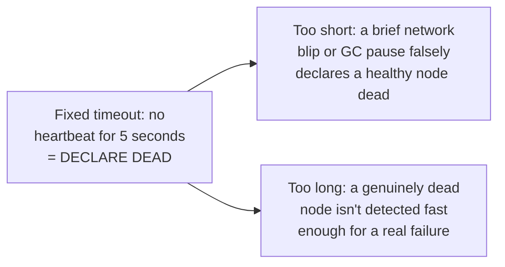
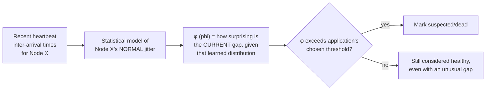

# Gossip Protocol — Senior

<!-- level-focus -->
At senior level, focus on this question:

> Why does a continuous "suspicion score" (Phi Accrual) make better failure
> detection than a fixed timeout, especially across an unreliable network?

Prerequisite: [`middle.md`](middle.md).

---

## The fixed-timeout problem

A fixed timeout forces a single, binary threshold to work for both a
perfectly healthy network under momentary load (where a delayed heartbeat
is normal and should be tolerated) and a genuinely failed node (where fast
detection matters) — one number can't be simultaneously optimal for both,
especially because normal network jitter varies over time and by
environment.

## Phi Accrual: a continuous, adaptive suspicion level

Instead of a binary alive/dead threshold, the **Phi Accrual failure
detector** (used by Cassandra and Akka, among others) computes a
continuously increasing **suspicion level (φ)** based on the actual,
recently-observed distribution of heartbeat inter-arrival times for that
specific node — it learns each node's normal jitter pattern and only
raises high suspicion when a gap significantly exceeds what's statistically
normal **for that node, recently**, not against one fixed global number.

The key advantage: the **application** chooses how aggressive to be (a
higher φ threshold = slower, more conservative detection; a lower threshold
= faster, more false-positive-prone) as a single tunable dial, while the
underlying statistical model automatically adapts to each node's actual,
recently-observed network behavior — a node on a naturally jitterier
network path doesn't get unfairly flagged as often as it would under a
one-size-fits-all fixed timeout.

> 🎯 **Senior takeaway:** Phi Accrual reframes failure detection from a
> binary yes/no question answered by one global constant, into a
> continuous confidence score computed from each node's own recent,
> observed behavior — directly addressing the fixed-timeout dilemma by
> letting "normal" be learned per-node rather than assumed globally.

## Test yourself

1. Why can't a single fixed timeout be simultaneously well-tuned for a
   fast-failure-detection requirement and a jittery, unreliable network?
2. Explain, conceptually, why Phi Accrual's suspicion score for the same
   heartbeat gap could differ between two different nodes in the same
   cluster.
3. What operational risk exists if an application sets its φ threshold too
   low (overly aggressive), and what risk exists if set too high
   (overly conservative)?

Continue to [`professional.md`](professional.md) to see how Cassandra and
Consul tune gossip for real production clusters.
