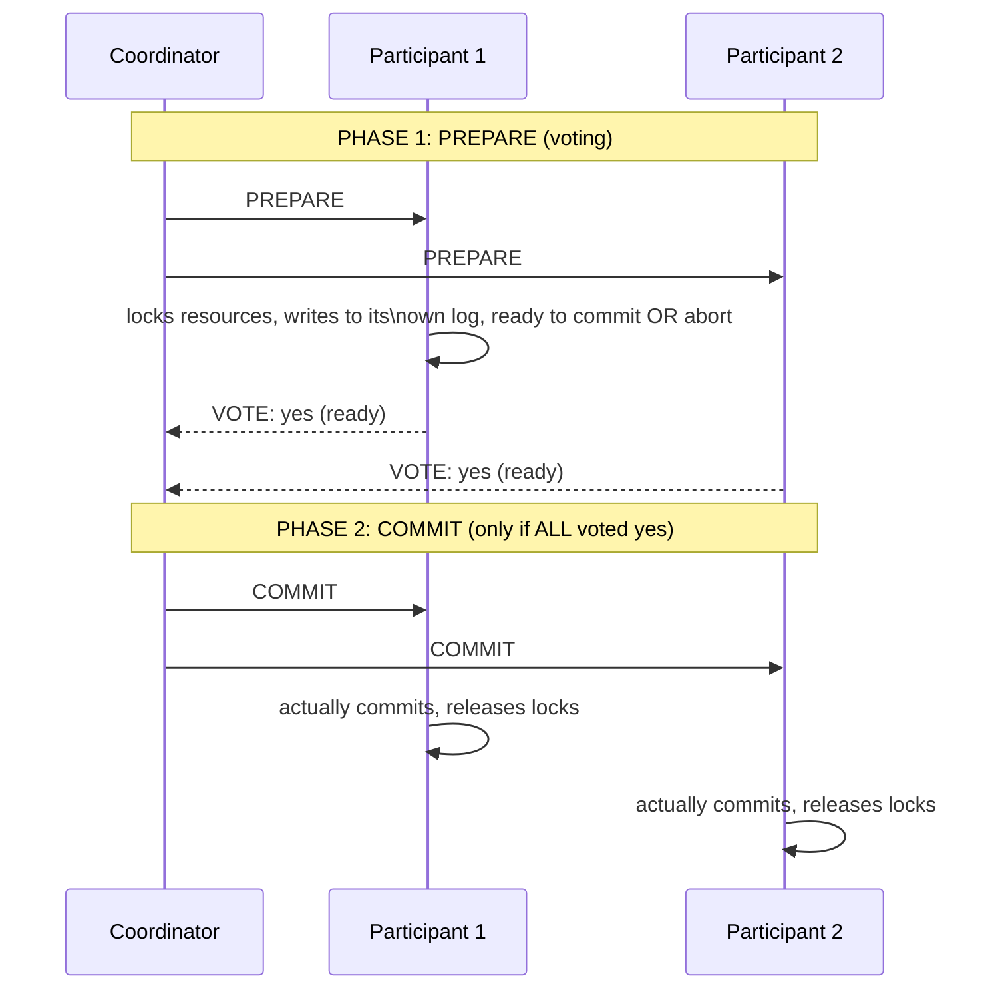

# Atomic Commit — Junior

<!-- level-focus -->
At junior level, focus on this question:

> How does Two-Phase Commit (2PC) get multiple independent databases to
> commit (or abort) together, as one atomic unit?

---

## The two phases

**Phase 1 (Prepare)**: the coordinator asks every participant "can you
commit this?" Each participant does everything needed to guarantee it
**can** commit if told to (acquiring locks, writing to its own durable log)
without actually committing yet, and votes yes or no.

**Phase 2 (Commit)**: if **every** participant voted yes, the coordinator
tells everyone to commit for real. If **any** participant voted no, the
coordinator tells everyone to abort instead — guaranteeing all-or-nothing
across every participant.

## Why "prepared" means "guaranteed to be able to commit"

A participant that votes "yes" in phase 1 is making a **binding promise**:
it must be able to commit later, no matter what happens to it in the
meantime (even a crash and restart) — this is why it must durably persist
its prepared state to its own log **before** voting yes, using the same
write-ahead-log durability guarantee from the Transactions & ACID
professional page.

> 🎓 **Takeaway:** 2PC's core trick is splitting "can I commit" from
> "actually commit" into two separate steps, so the coordinator only issues
> the final commit once it knows **everyone** is guaranteed able to follow
> through — this is exactly how 2PC achieves atomicity across multiple
> independent systems that have no other shared coordination mechanism.

## Test yourself

1. Why must a participant durably persist its "prepared" state before
   voting yes, rather than just voting yes based on its current in-memory
   state?
2. What happens if participant 1 votes yes but participant 2 votes no —
   walk through phase 2 in that case.
3. Why can't a participant simply "change its mind" and refuse to commit
   after it has already voted yes in phase 1?

Continue to [`middle.md`](middle.md).
