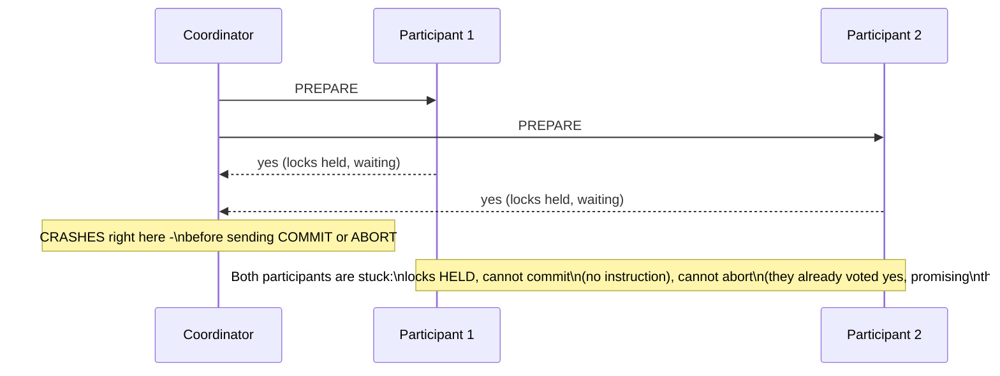
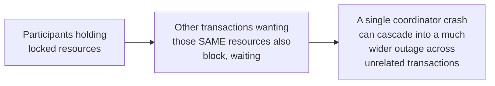

# Atomic Commit — Middle

<!-- level-focus -->
At middle level, focus on this question:

> What exactly happens to a participant if the coordinator crashes right
> after everyone votes "yes" but before sending the commit message?

Prerequisite: [`junior.md`](junior.md).

---

## The blocking problem

Once a participant votes "yes," it has made a binding promise and **cannot
unilaterally decide to abort** — it must wait for the coordinator's final
instruction. If the coordinator crashes at this exact moment, every
prepared participant is stuck **holding its locks indefinitely**, unable to
proceed in either direction, until the coordinator recovers (or a human
intervenes). This is 2PC's fundamental weakness: it's a **blocking**
protocol — a coordinator failure at the wrong moment can freeze every
participant's locked resources for an unbounded amount of time.

## Why this matters in practice

Held locks aren't free — other transactions wanting the same rows/resources
also block, waiting for the stuck participant to eventually resolve. A
coordinator crash at the worst possible moment can therefore cascade well
beyond the original transaction's own participants, which is a real
production risk that has made 2PC's use rare in practice despite its
conceptual simplicity — a risk 3PC (`senior.md`) attempts, but ultimately
fails, to fully solve.

> 🎓 **Takeaway:** 2PC guarantees atomicity (all-or-nothing) but not
> **availability during coordinator failure** — a crashed coordinator at
> the wrong instant can leave the entire transaction, and everything
> contending for its locked resources, frozen until it recovers. This is
> the specific, well-documented cost that makes 2PC a poor default choice
> for systems requiring high availability.

## Test yourself

1. Why can't a participant that voted "yes" simply decide, on its own, to
   abort after waiting a while with no word from the coordinator?
2. Walk through why a coordinator crash's impact can extend beyond the
   original transaction's own participants to unrelated transactions.
3. What would need to be true about the coordinator's own durability/
   recovery for the blocked participants to eventually be unblocked, even
   without human intervention?

Continue to [`senior.md`](senior.md).
